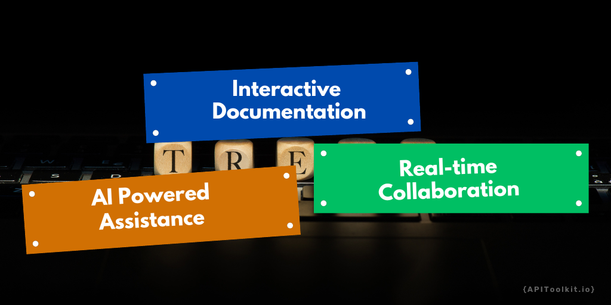

# API Documentation Trends to Watch out for in 2024: What's new and exciting

Today Application Programming Interfaces (APIs) are like the engines driving many amazing things we see online. From powering web services to enabling integrations between different systems, APIs are indispensable. However, an [API](https://apitoolkit.io/blog/api-as-a-product/) is only as good as its documentation. [API documentation](https://apitoolkit.io/blog/api-documentation-and-observability-the-truth-you-must-know/) serves as the roadmap for developers, outlining the functionalities, endpoints, and protocols necessary for practical [API usage](https://apitoolkit.io/blog/api-as-a-product/). As technology advances, so do the trends and best practices in [API documentation](https://apitoolkit.io/blog/api-documentation-and-observability-the-truth-you-must-know/), making it crucial for developers and businesses to stay updated.

The topic of "API Documentation Trends" may not initially grab your attention, but in today's tech-driven world, where APIs are at the core of business strategies and innovation, keeping up with these trends is essential. Whether it's the emergence of interactive documentation or the integration of AI-powered assistance, these trends are reshaping how APIs are documented and used.

So, what's exciting and new in the realm of API documentation? This article aims to uncover the latest trends that are reshaping the [API documentation](https://apitoolkit.io/blog/api-documentation-and-observability-the-truth-you-must-know/) landscape. From improving user experience to streamlining development processes, these trends provide insights into the future of API documentation. Join us as we explore these trends, understand their significance, and learn how they can impact you.

## The Importance of API Documentation

[API](https://apitoolkit.io/blog/api-as-a-product/) documentation is like a guidebook for developers, that helps users understand how to use an API's features. When this documentation is clear and easy to follow, more developers can use the API effectively. This accessibility is crucial for the API's success, as it attracts developers who might not be experts in its technology.

Beyond serving as a guide for developers, API documentation also has significant business implications. Comprehensive and user-friendly documentation can be a strong selling point for businesses looking to attract developers to their [API products](https://apitoolkit.io/blog/api-as-a-product/). After all, an API with poor or confusing documentation is less likely to be adopted, regardless of how powerful or innovative its features may be. In this sense, [API documentation](https://apitoolkit.io/blog/api-documentation-and-observability-the-truth-you-must-know/) serves as a form of marketing, communicating the capabilities and benefits of an API to potential users.

As technology evolves, APIs become more complex, making clear documentation even more important. Keeping up with the latest trends in how documentation is created and used is essential for [developers](https://apitoolkit.io/blog/api-documentation-and-observability-the-truth-you-must-know/) and [businesses](https://apitoolkit.io/blog/api-as-a-product/) to stay competitive.

## Emerging Trends in API Documentation

As earlier stated the  world of API documentation is not static; it's continuously evolving to meet the needs of developers and businesses. Here are some of the most exciting trends that are shaping the future of API documentation:

### Interactive Documentation: The New Standard for Developer Engagement
In the past, API documentation was static and dull, but now its becoming interactive. Interactive documentation allows developers to test endpoints, view responses, and even debug in real time, all within the documentation itself. This hands-on approach not only enhances understanding but also speeds up the development process.

Interactive documentation serves as a playground for developers, allowing them to experiment and understand the API's capabilities without leaving the documentation site. This hands-on approach not only deepens comprehension but also accelerates the development process. Developers can quickly see the results of their code, adjust as necessary, and move on to the next task, all without the need to switch between different platforms or tools.

As we move forward, expect to see even more advanced features integrated into interactive documentation. From embedded code editors to real-time analytics, the possibilities are endless. Companies that invest in creating robust, interactive documentation are likely to see higher engagement rates, quicker adoption, and ultimately, more successful API integrations.

### AI-Powered Assistance: The Smart Way to Navigate API Complexity
Artificial Intelligence is making its way into API documentation. AI-powered bots and automated suggestions can guide developers through complex queries, offer code snippets, and even detect errors before they become problems. This level of automation makes the documentation more intuitive and user-friendly.

The integration of AI into [API documentation](https://apitoolkit.io/blog/api-documentation-and-observability-the-truth-you-must-know/) brings a new level of intuitiveness and user-friendliness. Developers can receive instant help, whether it's auto-completing a line of code or suggesting an optimized query. This not only saves time but also reduces the likelihood of errors, making the development process smoother and more efficient. For businesses, this means quicker API adoption and fewer support tickets.

As AI technology continues to evolve, its role in API documentation is likely to expand. We can anticipate more sophisticated bots capable of understanding context, offering personalized suggestions, and even predicting developer needs based on behaviour analytics. These advancements will make API documentation not just a reference guide, but a smart assistant for developers.

### Real-Time Collaboration: The Collective Approach to API Documentation
Collaboration is key in any development project, and API documentation is no exception. New platforms are emerging that allow multiple users to collaborate on documentation in real time, similar to how Google Docs works. This feature is especially useful for large teams and open-source projects where many contributors may be involved.

Real-time collaboration in [API documentation](https://apitoolkit.io/blog/api-documentation-and-observability-the-truth-you-must-know/) offers several benefits. It allows for immediate feedback, streamlines the review process, and ensures that everyone is on the same page—literally and figuratively. This is particularly valuable in agile environments, where rapid iterations are the norm, and keeping documentation up-to-date is crucial.

As remote work becomes more prevalent and teams become more distributed, the need for effective collaboration tools will only increase. Future platforms may offer features like version control, role-based permissions, and even machine learning algorithms to automate repetitive tasks. These advancements will make collaborative API documentation more efficient, accurate, and inclusive, catering to the needs of diverse development teams.

## Why the Evolution in API Documentation is a Game-Changer

The advancements in [API documentation](https://apitoolkit.io/blog/api-documentation-and-observability-the-truth-you-must-know/) are far from being mere technological novelties. They have far-reaching implications that extend beyond the realm of innovation for its own sake. These changes are setting new benchmarks in the industry and are poised to have a transformative impact on both developers and businesses. Here's a deeper look into why these trends are so pivotal:

For Developers: A New Paradigm in Efficiency and Collaboration
These trends are not mere add-ons or optional features; they are fundamentally changing the way developers interact with APIs and, by extension, businesses that adapt to these changes are better positioned to offer more effective, user-friendly services. Interactive documentation, for instance, eliminates the cumbersome process of switching between the documentation and a separate testing environment. This streamlining can save countless hours and reduce errors, making the development process more efficient and less prone to mistakes. Similarly, AI-driven support can offer contextual help and predictive coding suggestions, significantly reducing the learning curve for new [APIs](https://apitoolkit.io/blog/api-as-a-product/) and making it easier for developers to hit the ground running.

For Businesses: A Competitive Edge in a Saturated Market
In today's hyper-competitive landscape, businesses need every advantage they can get, and the advancements in API documentation offer just that. An [API](https://apitoolkit.io/blog/api-as-a-product/) that comes with cutting-edge, user-friendly documentation is not just a nice-to-have; it's a compelling differentiator that can attract and retain a loyal developer community. This, in turn, can lead to increased API adoption, more third-party integrations, and ultimately, higher revenue streams. Additionally, top-notch documentation can minimize the need for extensive customer support, thereby reducing operational costs and enhancing customer satisfaction.

Inclusivity and Accessibility: Perhaps the most transformative aspect of these trends is their democratizing effect. Real-time collaboration and user-friendly interfaces make it possible for a broader range of stakeholders to participate in the [documentation](https://apitoolkit.io/blog/writing-api-documentation/) process. This includes project managers, technical writers, and even non-technical team members. By making the documentation process more inclusive, these advancements ensure that the end product is not only technically comprehensive but also accessible and easy to understand for a wider audience.

These shifts in [API documentation](https://apitoolkit.io/blog/api-documentation-and-observability-the-truth-you-must-know/) are not fleeting trends; they are setting new industry standards. Understanding their far-reaching implications is crucial for anyone involved in the development, deployment, or consumption of APIs. As we move forward, these trends are likely to become the new norm, shaping the future of API interaction for years to come.

## Future Outlook - The Next Frontier in API Documentation

As we stand on the cusp of a new era in technology, it's evident that the current advancements in [API documentation](https://apitoolkit.io/blog/writing-api-documentation/) are merely the prologue to a much larger narrative. The fusion of emerging technologies like machine learning augmented reality, and blockchain is set to redefine the landscape of API documentation in ways we can only begin to imagine. Here's an in-depth exploration of what the future might have in store:

Personalized Documentation
The concept of one-size-fits-all is becoming increasingly obsolete, especially in the realm of [API documentation](https://apitoolkit.io/blog/writing-api-documentation/). Imagine a future where the documentation is not just a static set of instructions but a dynamic, evolving entity. Utilizing machine learning algorithms, the documentation could analyze individual developer behaviours, preferences, and even past queries to present a highly personalized set of guidelines, examples, and best practices. This level of personalization could drastically reduce the learning curve and accelerate the development process, making it a win-win for both developers and businesses.

Augmented Reality Assistance
The potential applications of augmented reality (AR) in [API documentation](https://apitoolkit.io/blog/api-documentation-and-observability-the-truth-you-must-know/) are nothing short of revolutionary. Imagine a developer working on a line of code when an augmented reality overlay pops up. This overlay provides instant guidance, alternative code suggestions, and even predictive debugging tips. Such an interactive feature could not only make coding more user-friendly but also minimize errors, boosting both efficiency and the quality of the code.

Decentralized Documentation
In a world where data integrity is paramount, the application of blockchain technology in [API documentation](https://apitoolkit.io/blog/api-documentation-and-observability-the-truth-you-must-know/) could be a game-changer. By creating decentralized versions of documentation, blockchain could offer an immutable, tamper-proof resource that is consistently up-to-date. This could eliminate the risks associated with outdated information or unauthorized alterations, thereby instilling a higher level of trust and reliability in the documentation.

The Imperative of Staying Ahead
While these scenarios may seem like they're ripped from the pages of a science fiction novel, the velocity of technological innovation suggests that they could very well become a reality in the not-so-distant future. For businesses and developers alike, keeping a finger on the pulse of these emerging trends is not just a strategic move—it's an imperative for survival in an ever-evolving digital landscape.

## Conclusion

[API documentation](https://apitoolkit.io/blog/api-documentation-and-observability-the-truth-you-must-know/) is undergoing a transformation, driven by technological advancements and the ever-increasing demands of developers and businesses alike. From interactive documentation and AI-powered assistance to real-time collaboration, the trends shaping this space are making it easier than ever to create, understand, and implement APIs. These trends are not just fleeting fads; they are setting new benchmarks for what constitutes effective API documentation.

As we look to the future, the possibilities are boundless. Technologies like machine learning, augmented reality, and blockchain have the potential to further disrupt the way we think about [API documentation](https://apitoolkit.io/blog/api-documentation-and-observability-the-truth-you-must-know/). Staying ahead of these trends is not just beneficial; it's imperative for anyone involved in the API ecosystem. In a world where APIs are becoming the building blocks of digital transformation, understanding the trends in [API documentation](https://apitoolkit.io/blog/api-documentation-and-observability-the-truth-you-must-know/) is crucial. Whether you're a developer, a business leader, or a curious observer, these trends offer a glimpse into the future of API interaction and the endless possibilities it holds.

- - -

## Keep Reading

- [The Rise of API-as-a-Product: How Companies are Leveraging APIs to Drive Revenue](https://apitoolkit.io/blog/api-as-a-product/)
- [API Monitoring and Documentation: The Truth You Must Know](https://apitoolkit.io/blog/api-documentation-and-observability-the-truth-you-must-know/)
- [Writing API Documentation - Best Practices and Mistakes to Avoid](https://apitoolkit.io/blog/api-documentation-and-observability-the-truth-you-must-know/)
- [How to Write API Documentation: 10 Essential Guidelines](https://apitoolkit.io/blog/how-to-write-api-docs/)
- [A Comprehensive API Management Strategy for Businesses](https://apitoolkit.io/blog/the-ultimate-api-management-strategy/)
