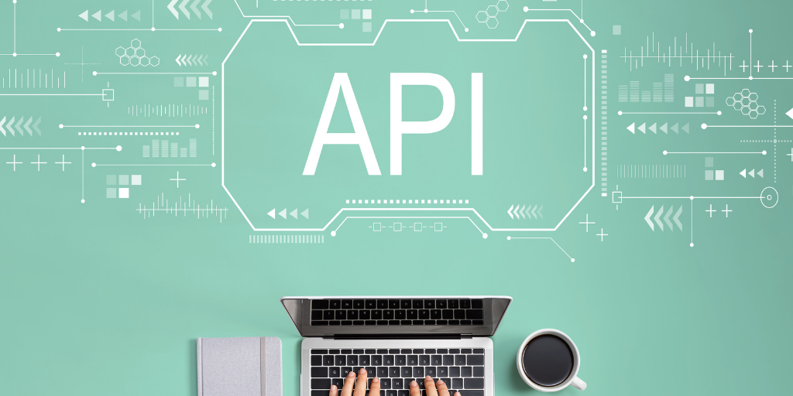
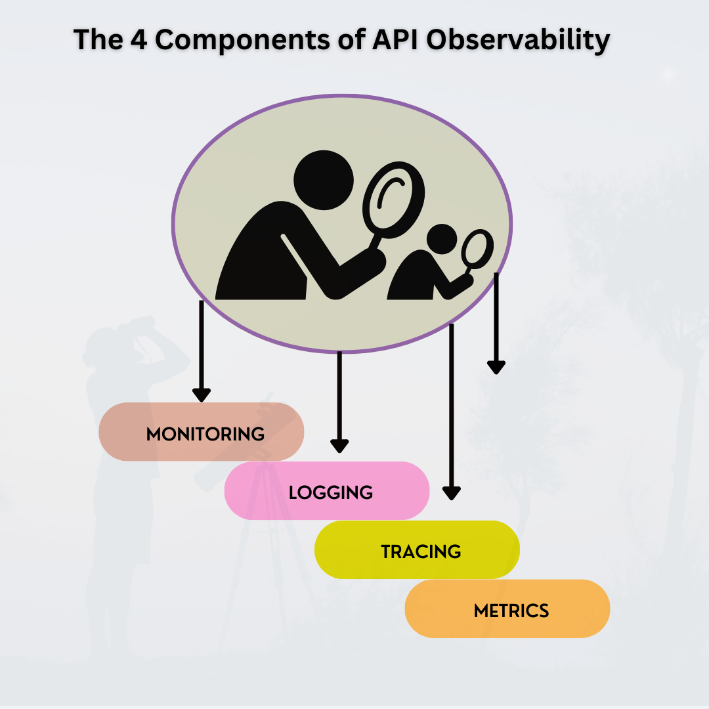

## Introduction to API Observability

If you're building or managing APIs, you know how important it is to keep them running smoothly and efficiently. You also know how challenging it can be to monitor, troubleshoot, and optimize them in a complex and dynamic environment. That's where API observability comes in.

API observability is the ability to understand the internal state of an API from the data it produces and the ability to explore that data to answer questions about what happened and why. In this guide, we'll explain what API observability is, why it matters, and how to achieve it using four key components: 

- Monitoring,
- Logging, 
- Tracing, and 
- Metrics.

### Definition of API Observability

API observability is a term that derives from the concept of observability in control theory, which states that a system is observable if its current state can be determined by its outputs. In the context of APIs, observability means that we can infer the behavior and performance of an API from the signals it emits, such as metrics, events, logs, and traces.

These signals are also known as telemetry data, and they provide valuable insights into how an API is functioning, how it is being used, and how it can be improved. To collect this data, an API must be instrumented with event listeners, agents, or libraries that enable teams to passively capture and forward the data to a centralized platform or tool for analysis.

Read: [10 Must-Know API Trends in 2023](https://apitoolkit.io/blog/api-trends/)

### Importance of API Observability

API observability is essential for any organization that relies on APIs to deliver value to its customers or stakeholders. APIs are the backbone of modern applications and services, and they enable communication and integration across distributed systems and microservices. However, this also introduces complexity and uncertainty, as [APIs can fail or degrade]() for various reasons, such as network issues, code errors, configuration changes, or external dependencies.

Without API observability, teams may struggle to detect, diagnose, and resolve issues that affect their APIs' availability, performance, reliability, or security. This can result in a poor user experience, lost revenue, a damaged reputation, or even legal liabilities. Moreover, teams may miss opportunities to optimize their APIs' design, functionality, or scalability based on real-world feedback and usage patterns.

API observability helps teams overcome these challenges by providing them with a comprehensive and granular view of their APIs' health and performance. It enables teams to not only monitor their APIs' status and metrics in real-time, but also drill down into the details of individual requests and responses to identify root causes and anomalies. It also allows teams to understand how their APIs are being consumed by different clients and users, and how they impact key business outcomes.

By leveraging API observability data, teams can proactively prevent or mitigate issues before they affect users or customers. They can also continuously improve their APIs' quality and efficiency by applying data-driven decisions and feedback loops. 

Ultimately, API observability empowers teams to deliver better APIs faster and more confidently.

Read: [Key Benefits of API Integration for Developers (with Statistics)](https://apitoolkit.io/blog/benefits-of-api-integration/)

## Key Components of API Observability

API observability is not a single tool or technique, but rather a combination of four complementary components: monitoring, logging, tracing, and metrics. Each component provides a different perspective on an API's behavior and performance, and together they form a holistic picture of an API's observability.

### Monitoring

Image source: APIToolkit dashboard

[Monitoring](https://apitoolkit.io/api-performance-monitoring-and-compliance/) is the process of collecting and analyzing data about an API's operational status and performance over time. It helps teams ensure that their APIs are functioning correctly and meeting their expected service level objectives (SLOs) or agreements (SLAs).

Monitoring typically involves two sub-components: end-to-end performance monitoring and alerting.

#### End-to-End Performance Monitoring

End-to-end performance monitoring measures how fast and reliable an API responds to requests from different sources and locations. It tracks metrics such as response time, latency, throughput, error rate, availability, uptime, downtime, etc.

End-to-end performance monitoring can be done using synthetic tests or real user monitoring (RUM). Synthetic tests simulate user requests at regular intervals from various locations or scenarios to check if an API meets its predefined performance thresholds or benchmarks. RUM captures user requests as they occur in production environments to measure how an API performs under real-world conditions.

Both synthetic tests and RUM can help teams identify performance bottlenecks or issues across different regions or devices. They can also help teams compare their APIs' performance against competitors or industry standards.

Read: [API Monitoring and Documentation: the Truth You Must Know](https://apitoolkit.io/blog/api-documentation-and-observability-the-truth-you-must-know/)

#### Alerting

Alerting is the process of notifying teams when an API experiences abnormal or critical conditions that require immediate attention or action. It helps teams minimize the impact of issues on users or customers by enabling faster detection and resolution.

Alerting typically involves defining rules or policies that specify what conditions trigger an alert (such as exceeding a certain error rate or response time), what severity level the alert has (such as warning or critical), and what actions to take when an alert is triggered (such as sending an email, SMS, or webhook).

Alerting can also be integrated with other tools or platforms, such as incident management, chatops, or automation, to streamline the workflow of responding to alerts and resolving issues.

### Logging

Image source: APIToolkit logs and metric explorer

Logging is the process of recording and storing data about an API's events or activities. It helps teams troubleshoot and debug issues by providing detailed information about what happened and why.

Logging typically involves two sub-components: gathering log data and analyzing log data.

#### Gathering Log Data

Gathering log data is the process of capturing and forwarding data about an API's requests and responses, such as headers, parameters, payloads, status codes, timestamps, etc. It can also include data about an API's internal state or environment, such as memory usage, CPU load, configuration settings, etc.

Gathering log data can be done using various methods or frameworks, such as logging libraries, [middleware](), agents, or proxies. The log data can then be sent to a centralized platform or tool for storage and analysis.

#### Analyzing Log Data

Analyzing log data is the process of querying and exploring data about an API's requests and responses to find patterns, trends, anomalies, or errors. It can also involve aggregating, filtering, or visualizing log data to create dashboards or reports.

Analyzing log data can help teams diagnose the root cause of issues by tracing the execution path of an API request or response. It can also help teams optimize their APIs' performance or functionality by identifying areas for improvement or enhancement.

Read: [How to Analyze API Logs and Metrics for Better Performance (Ultimate Guide)](https://apitoolkit.io/blog/api-logs-and-metrics/)

### Tracing

[Tracing](https://apitoolkit.io/api-anomalies-validation-and-checks/) is the process of tracking and visualizing the flow of an API request or response across multiple services or components. It helps teams understand how their APIs interact with other systems and how they contribute to the overall user experience.

Tracing typically involves two sub-components: distributed tracing and root cause analysis.

#### Distributed Tracing

Distributed tracing is the process of correlating and linking data from different sources or services that are involved in processing an API request or response. It creates a trace that represents the entire journey of an API request or response from start to finish.

Distributed tracing can be done using various methods or frameworks, such as headers, identifiers, tags, spans, etc. The trace data can then be sent to a centralized platform or tool for visualization and analysis.

#### Root Cause Analysis

Root Cause Analysis is the process of identifying and resolving the underlying cause of an issue that affects an API request or response. It involves examining the trace data to find where and why an issue occurred.

Root Cause Analysis can help teams fix issues faster and more effectively by pinpointing the exact service or component that caused the problem. It can also help teams prevent issues from recurring by applying corrective actions or preventive measures.

Read: [API Management: How to Tackle Anomalies in RESTful APIs (the Right Way)](https://apitoolkit.io/blog/anomalies-in-restful-apis/)

### Metrics

[Metrics](https://apitoolkit.io/api-logs-and-metrics/) are the process of measuring and quantifying data about an API's usage and performance. They help teams understand how their APIs are delivering value to their users or customers and how they are impacting their business goals.

Metrics typically involve two sub-components: API usage metrics and performance metrics.

#### API Usage Metrics

API usage metrics measure how an API is being consumed by different clients or users. They track metrics such as requests volume, requests distribution, requests frequency,
requests duration, etc.

API usage metrics can help teams understand who their users are, what they need, how they behave, and how they perceive their APIs. They can also help teams optimize their APIs' design, functionality, or scalability by identifying user feedback, preferences, or expectations.

#### Performance Metrics

Performance metrics measure how an API is affecting key business outcomes or objectives. They track metrics such as revenue, conversion rate, retention rate, churn rate etc.

Performance metrics can help teams align their APIs' strategy with their business strategy by demonstrating how their APIs contribute to their bottom line. They can also help teams improve their APIs' quality or efficiency by identifying opportunities for growth or optimization.

## Conclusion

The significance of API observability in modern software development cannot be overstated. As software systems become increasingly complex and interconnected, APIs serve as the backbone, facilitating seamless communication between various components and services. However, without adequate observability, APIs can become black boxes, making it difficult to diagnose issues, ensure optimal performance, and deliver a positive user experience.

By leveraging [observability tools](https://apitoolkit.io/blog/best-api-monitoring-and-observability-tools/) and [techniques](https://apitoolkit.io/blog/web-api-performance/), teams can gain a comprehensive understanding of API behavior, [pinpoint bottlenecks](https://apitoolkit.io/blog/web-api-performance/), identify potential vulnerabilities, and optimize system performance.

Moreover, API observability enhances collaboration between development and operations teams, fostering a proactive approach to maintaining and improving APIs. By sharing observability data and leveraging real-time monitoring, teams can quickly detect anomalies, investigate root causes, and implement remediation measures, reducing downtime and enhancing system reliability.

***

Try [APIToolkit](https://apitoolkit.io), a robust API management toolbox with all the tools you need to build and manage the most reliable APIs.

***

**Keep Reading**

[API Documentation vs API Specification - What it means for you](https://apitoolkit.io/blog/api-documentation-vs-api-specification/)

[Incident Management: How to Resolve API Downtime Issues Before It Escalates](https://apitoolkit.io/blog/api-downtime/)

[How to Generate Automated API Documentation](https://apitoolkit.io/blog/how-to-generate-automated-api-documentation/)