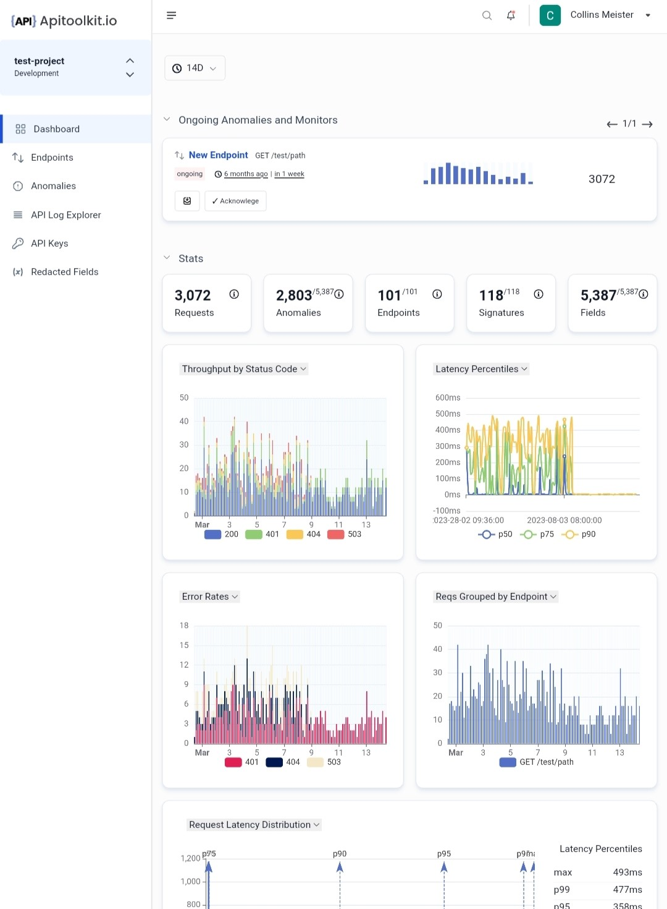
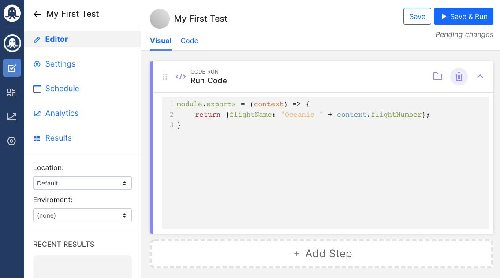

# What is API Testing and Why Should You Do It?

"Photo by [Fahim Muntashir](https://unsplash.com/@f12r?utm_source=unsplash&utm_medium=referral&utm_content=creditCopyText) on [Unsplash](https://unsplash.com/s/photos/api?utm_source=unsplash&utm_medium=referral&utm_content=creditCopyText)"

If you’re reading this, then I’m going to assume you already know what an API is. But, for the sake of those who may not know, I’ll touch on the fundamentals a bit.

## What Is an API (Application Programming Interface)?

An API is a software interface that allows data exchange and communication between two separate software applications. One system executes the API, while another performs its functions and subroutines. The API specifies the data formats, methods, and requests that can be made between two software systems.

APIs are the reason why you can log in to your Twitter account using your Google account credentials. What happens, in very simple terms, is that Twitter sends a request to Google via APIs to fetch your data and voila, you’re in!

## What Is API Testing?

API testing is the practice of validating the integrity and [functionality of APIs](https://apitoolkit.io/blog/api-documentation-and-observability-the-truth-you-must-know/) by sending requests across system software and evaluating system responses. In API testing special software is used to send calls to the API eing tested while the responses are noted and analyzed. 

API testing works on the [business logic](https://www.investopedia.com/terms/b/businesslogic.asp#:~:text=Business%20logic%20is%20the%20custom,constrains%20how%20a%20business%20operates) layer of a codebase, so any anomalies detected could lead to astronomical effects
One could say that APIs make up the background framework of the internet as we know it today. This is why [API tests are invaluable](https://www.mckinsey.com/business-functions/mckinsey-digital/our-insights/the-seven-make-or-break-api-challenges-cios-need-to-address).

Read: [Best API Monitoring and Observability Tool in 2023](https://apitoolkit.io/blog/best-api-monitoring-and-observability-tools/)

## Why Should You Test APIs?

API testing is crucial now more than ever because APIs serve as the primary link to business logic. Perhaps, the most important reason for API testing is that as a system scales, changes are made across the codebase. API regression tests can help to detect whether a system upgrade results in a break in [API interfaces](https://apitoolkit.io/blog/the-ultimate-api-management-strategy/). 

Such a break could have catastrophic results for web apps that rely on those APIs.

On the other hand, [API observability](https://apitoolkit.io/blog/best-api-monitoring-and-observability-tools/) like what we do at [APItoolkit](https://apitoolkit.io) can help you detect breaks in API interfaces that your web app relies on. 
For more context, here’s a list of the types of bugs that can be detected by API tests

- Duplicate functionality
- Missing Functionality
- Incorrect structuring of Response Data (JSON or XML)
- Problems in calling and getting a response from an API.
- Security Issues
- Incorrect handling of valid argument values
- Performance lapses.

Read: [How to Tackle Anomalies in RESTful APIs](https://apitoolkit.io/blog/anomalies-in-restful-apis/)

## API Testing techniques

A. **Unit Testing:**
Unit testing focuses on testing individual API components in isolation to ensure they function correctly and produce the expected outputs.

B. **Functional Testing:**
Functional testing verifies the API's compliance with functional requirements by testing its inputs, outputs, and interactions with external systems.

C. **Load Testing:**
Load testing evaluates the performance and stability of APIs under varying levels of workload to ensure they can handle expected traffic and scale effectively.

D. **Security Testing:**
Security testing assesses the API's vulnerability to potential threats, ensuring that appropriate security measures are in place to protect data and system integrity.

E. **Error Handling Testing:**
Error handling testing validates how APIs respond to different types of errors, ensuring that appropriate error codes, messages, and recovery mechanisms are implemented.

F. **Interoperability Testing:**
Interoperability testing focuses on testing the compatibility and seamless integration of APIs with different systems, platforms, and programming languages.

Read: [Key Benefits of API Integration for Developers (with Statistics)](https://apitoolkit.io/blog/benefits-of-api-integration/)

## Key Considerations for Testing APIs

1. **Test Coverage and Test Cases:**
Designing comprehensive test cases and ensuring sufficient test coverage is essential to ensure that all critical API functionalities are thoroughly tested.

2. **Test Environment Setup:**
Creating a reliable and representative test environment that closely mimics the production environment is crucial for accurate testing and reproducing real-world scenarios.

3. **Test Data Preparation:**
Preparing relevant and realistic test data sets that cover various scenarios is essential to validate the API's behavior under different conditions.

4. **Handling Authentication and Authorization:**
APIs often involve authentication and authorization mechanisms. Testing these components ensures that only authorized users can access the API's functionalities.

5. **Performance Optimization:**
Optimizing API performance is vital to provide a seamless user experience. Conducting performance tests and identifying bottlenecks can help optimize response times and resource utilization.

Read: [Must-Know API Trends in 2023](https://apitoolkit.io/blog/api-trends/)

## API Testing Best Practices

Adhere to these API testing best practices:

A. **Test Automation:**
Automating API tests allows for faster execution, better test coverage, and early detection of regressions. It also facilitates integration with Continuous Integration/Continuous Delivery (CI/CD) pipelines.

B. **API Documentation and Specifications:**
Clear and [comprehensive documentation](https://apitoolkit.io/blog/how-to-write-api-docs/), along with well-defined [API specifications](https://apitoolkit.io/blog/api-documentation-vs-api-specification/) (such as OpenAPI or Swagger), helps developers and testers understand the API's intended behavior and aids in test design.

C. **Versioning and Dependency Management:**
As APIs evolve over time, maintaining proper versioning and managing dependencies becomes critical to ensure backward compatibility and minimize disruptions in existing integrations.

D. **Continuous Integration and Continuous Testing:**
Integrating API testing into CI/CD workflows enables regular and automated testing, ensuring that API changes do not introduce regressions and that the overall system remains stable.

E. **Collaboration between Developers and Testers:**
Close collaboration between developers and testers promotes a shared understanding of API functionalities, requirements, and potential edge cases, leading to more effective testing and bug resolution.

Read: [Top 7 Reasons Why Your Team Needs an API Monitoring ](https://apitoolkit.io/blog/why-you-need-an-api-monitoring-tool/)

## API Testing Tools

API testing can be done with a variety of automated tools.

- **APIToolkit**: APIToolkit possesses all the tool you need to design, TEST, and monitor your APIs. It's the one-stop toolbox for [API developers](https://apitoolkit.io/blog/top-8-api-documentation-tools-for-developers/) utilizing a variety of tech stack.
   
- **Rapid API testing**: Over 1 million developers and 10,000 APIs are available on Rapid API testing. It’s an API testing solution for managing complex API tests throughout the development process. You can run tests for any type of API (including REST, SOAP, and GraphQL).
  
- **SOAPUI test**: Mainly used for REST, SOAP, and other mainstream API and IoT systems.
  [Image Source](https://www.soapui.org/getting-started/rest-testing/)
- **Postman testing**: Commonly used for REST APIs
  
- **Parasoft testing**: It’s a paid tool. It’s used for comprehensive API testing.
  

Read: [How to Generate Autoated API Documentation](https://apitoolkit.io/blog/how-to-generate-automated-api-documentation/)

## What Are API Test Cases Based on?

QA teams are usually in charge of API testing. It’s normal to see them follow a predefined strategy to conduct the API testing after the build is ready. This testing may not necessarily include the source code. The API testing approach helps to better understand the functionalities, security and testing techniques, input parameters, and the execution of test cases.

API test cases are based on the following considerations

- **Failure to return a value**: This is an event in which there is no return value when an API is called.
Trigger some other API/event/interrupt: Events and interrupt listeners should be tracked when an API output triggers some events.

- **Return value based on input condition**: This is pretty straightforward. Input is made and the results are authenticated.

- **Update data structure**: Changing data structures will have some effect on the system, which should be authenticated
Modify certain resources: API calls that modify resources should be checked by accessing the corresponding resources

Read: [How to Write API Documentation: 10 Essential Guidelines](https://apitoolkit.io/blog/how-to-write-api-docs/)

## Key Takeaways 

- APIs are software interfaces that allow data exchange and interaction between two different software applications.

- The purpose of API testing is to validate the integrity and functionality of APIs by sending requests across various systems and evaluating system responses.

- When approaching API testing, assess which APIs can enable important customer-facing applications/solutions and which can provide a solid technical foundation.

- API testing should be prioritized based on company strategy, business and modernization impact, as well as ability to execute.

- Develop API testing standards for your organization and train developers on prioritization.

## Final Thoughts on API Testing 

API testing represents the most fundamental measure in maintaining the seamless operation of application systems.

When APIs are not tested thoroughly, it leads to problems in the API and calling applications. Suffice it to say that API testing is indispensable in software engineering. A break in an API calling system for a few seconds could have huge financial consequences.

API toolkit essentially provides [API observability and testing as a service](https://apitoolkit.io). We augment your QA team, to detect issues automatically and in real-time.

Recommended Post: [How to Tackle ANomalies in RESTful APIs (the Right Way](https://apitoolkit.io/blog/anomalies-in-restful-apis/)

Recommended Post: [API Documentation vs Specification: What It Means for You](https://apitoolkit.io/blog/api-documentation-vs-api-specification/)

Recommended Post: [A Comprehensive API Management Strategy for Businesses](https://apitoolkit.io/blog/the-ultimate-api-management-strategy/)

Recommended Post: [The Rise of API-as-a-Product (2023)](https://apitoolkit.io/blog/api-as-a-product/)
