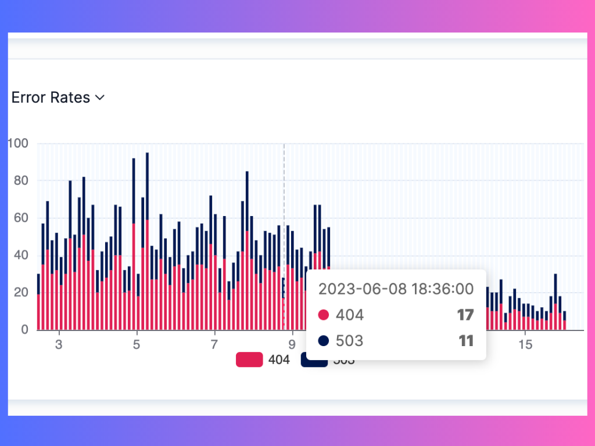

Your website is a dynamic entity. A lot happens on a daily basis; hundreds or more [API](https://apitoolkit.io/blog/best-api-monitoring-and-observability-tools/) requests are sent regularly which makes monitoring the integrity of each call a demanding task.

Developers may choose to ignore APIs that are provided by reputable companies. However, data shows that even the most reputable developer playgrounds like [Discord](https://www.reddit.com/r/discordapp/comments/1642251/discord_server_outage/) and Slack have experienced [downtime](https://apitoolkit.io/blog/api-downtime/) due to APIs breaking. The truth is, no one’s immune to downtime.

The good news is that a Plug-and-play [API observability and monitoring](https://apitoolkit.io/blog/api-documentation-and-observability-the-truth-you-must-know/) tool like APIToolkit can show your data in real time and alert you the second something breaks. This ensures you stay on top of your processes.

Here are the top ... reasons why you should use APIToolkit.

## 1. APIToolkit Was Built by Developers for Developers

[APIToolkit](https://apitoolkit.io) was built by software engineers to solve problems that have cost founders, startups and tech companies lots of money. [Anthony](https://twitter.com/tonialaribe), one of the co-founders of APIToolkit can be quoted saying, “We’re engineers at our core, who are very close to the problems we are solving. So, we encourage our users to be a part of this community evolving solutions to solve API documentation and observability.”

The team at APIToolkit has a combined experience of 17+ years in software development. Not only does APIToolkit provide observability and monitoring services, but we also have a supportive community on Discord where you can have open conversations with us. 

Feel free to join the community or book a call with Anthony to chat about your experiences with API documentation and observability.

## 2. Stay up to Date With Your API Documentation

Image source: [APIToolkit](https://apitoolkit.io)'s Log Explorer feature

To keep our users informed in real time, we offer [live auto-generated API documentation](https://apitoolkit.io/api-documentation-and-developer-portals/), contract monitoring and alerts. This ensures you’re notified of any changes to your APIs. New fields, new endpoints, empty fields, changes in field types, etc.

Our plug & play integration also lets you view your live API shapes, fields, etc., and generate Swagger docs at anytime via your live traffic.

Our dynamic notifications provide an extra layer of security against users with malicious intent or an unintentional coding error. For example, users may intentionally or unintentionally bombard an endpoint with traffic. 

Such abnormally large amounts of traffic may overload your server and cause a DDoS outage. You can prevent this by setting up a notification for any abnormal increase in the number of queries against the endpoint. 

This functionality can notify your security team if an endpoint receives abnormally large numbers of requests, so they can take action immediately.

## 3. View Your API Analytics in One Place

Image source: APIToolkit dashboard

With our comprehensive dashboard, you can view response times, latency, etc. You can also run queries on your live API requests and responses.

Our API analytics provide faster queries and deeper insights into a buggy API to enhance your debugging process. For instance, APIToolkit offers real-time insights into your logs that scales substantially with the number of API calls. Adding APIToolkit to your API stack enables you to

View API logs and replay requests in Postman or cURL in seconds
Real-time tailing and filtering of HTTP requests
Examine HTTP request and response payloads
Utilize a variety of parameters to segment and aggregate API calls at scale

## 4. Stay Vigilant with Our Anomaly Detector

Our powerful [Anomaly Detector tool](https://apitoolkit.io/api-anomalies-validation-and-checks/) monitors your API endpoints traffic and reports any form of changes to you. It metoculously monitors your endpoints, tracking activities and alerting you about any alteration or changes – your watchman during the day and at night.

Examples of an anomaly could be that a new endpoint was created, a new field was added to the endpoints, a field is behaving differently from how it used to, an endpoint speed has suddenly dropped, a sudden drop in your traffic, etc. Basically, any form of changes to your endpoints that returns an unfamiliar response will be tracked and reported by our powerful Anomaly Detector tool. It’s now left for you to acknowledge whether the change was sanctioned by you, or you take action.

In a nutshell, APIToolkit will verify that your payloads are returning the correct data and would notify you of any changes.

Generally, we spot errors and address them before your customers do.

## 5. Detect and resolve issues 99 times faster

In a situation whereby your APIs are experiencing errors, latency, downtime, or anomalies, [APIToolkit raises an alarm](https://apitoolkit.io/api-performance-monitoring-and-compliance/), alerting you right on time. You can then drill down into the root cause of the issue via our Log Explorer. APIToolkit empowers you with the tools to track and resolve errors and bugs before your customers notice them.

## 6. Refactor and Migrate Safely
You no longer have to break your APIs to refactor them. Catch bugs and changes due to refactorings or migrations faster than your customers. Stay on top of your game with one dashboard that provides you with the analytics you need for seamless service.

Furthermore, you can quickly and seamlessly debug errors without tedious log-searching and fragile single-metric tests.

Lastly, APIToolkit can help you uncover deeper insights about your API usage than you can with simple infrastructure monitoring. It's a complete observability tool.

## 7. Ensure Your API Security and Compliance

 Image source: Error rates dashboard on APIToolkit

APIToolkit can help you protect your APIs from damages caused by malicious attacks, but alerting you when we find shady behaviour, like someone trying out SQL injection attacks on your endpoints. And also let you know when we find non-standard credential passing workflows in your system.

## 8. Get a Bird's Eye View of your Entire API

APIToolkit is equipped with the most advanced tools to give you a detailed insight into everything that is happening on your API. From the list of all your endpoints to metrics to documentation, etc., we have got you covered.

In a nutshell, you stay on top of your APIs in real time. You can view your endpoints, fields, and even export your API as swagger if you like. The always up-to-date documentation is generated automatically from your live traffic.

## Final Thoughts
Automating your processes isn’t always the answer to efficiency problems. But in this case, it definitely is. [APIToolkit](https://app.apitoolkit.io/) comes with features to supercharge your documentation and monitoring processes, keeping you alert, and saving you time and money.

**Also Read**:

[Best API Monitoring and Observability Tools in 2023](https://apitoolkit.io/blog/best-api-monitoring-and-observability-tools/)

[Web API Performance Best Practices: the Ultimate Guide](https://apitoolkit.io/blog/web-api-performance/)

[How to Analyze API Logs and Metrics for Better Performance](https://apitoolkit.io/blog/api-logs-and-metrics/)

[Incident Management: How to Resolve API Downtime Issues Before It Escalates](https://apitoolkit.io/blog/api-downtime/)

