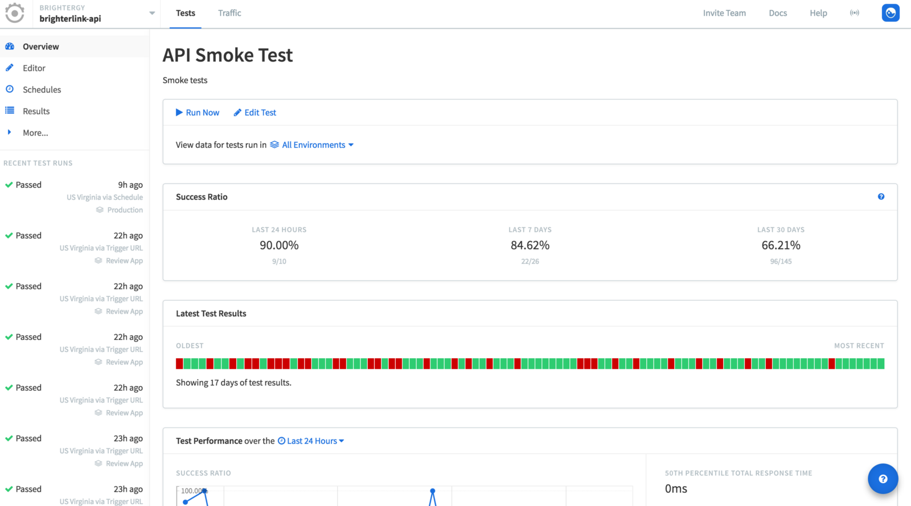
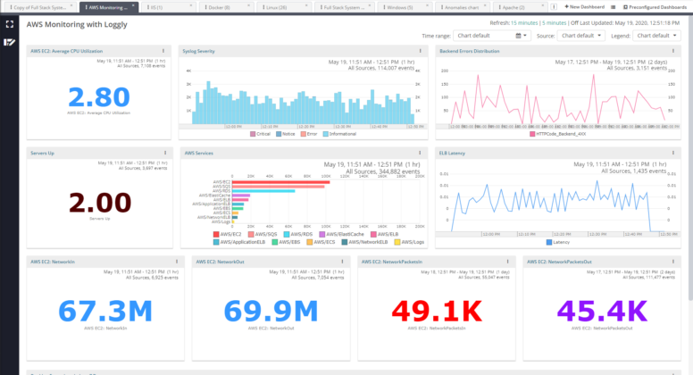

In fact almost every  upa and running system make use of APIs on way or another. APIs act as the silent workhorses, facilitating seamless communication between applications and powering the digital experiences we rely on. 

However, APIs are fragile, and their malfunction can cause a lot to your websites,apps, system, frustrate users, and damage business reputation. This is where API monitoring becomes a critical lifeline, providing real-time insight into an API's health and performance. 

But with a plethora of tools available, selecting the right one can be daunting. While Sematext reigns as a popular choice, its feature set and pricing might not fit every need

## The Problem with Sematext
Sematext, a popular observability suite, offers log monitoring, synthetics, and RUM, but cracks start to show as your needs grow. While it boasts flexible pricing (plans begin at $50/month for logs and $29/month for monitor bundles), its shortcomings might leave you yearning for a better fit.

Sematext ticks some boxes with its full-stack coverage and seamless setup. You can even customize alerts, integrate with incident management systems, and leverage pre-built dashboards. 

However, while Sematext shines in many ways, it's not without its shadows. Some users note limitations in customizability, finding it challenging to tailor dashboards and alerts to their specific needs. 

Additionally, pricing plans can climb steeply for larger APIs or high monitoring volumes, potentially exceeding budgets.  ALso, limited integrations hamper tool synergy, transaction tracing is absent (making complex troubleshooting a nightmare), and costs can huge with scaling usage. 

And let's not forget the UI slowdown under data pressure and the Logsene search learning curve. Plus, inactive apps vanish after 31 days, and the 500MB/day free plan barely quenches data-thirsty APIs. 

**Features**

* Log Monitoring
* Full stack observability
* Infrastructure Monitoring
* Real User Monitoring
* Synthetic Monitoring
* SSL Certificate Monitoring
* Status Pages
* Alerting with anomaly detection
  

**Pros**

* Logs Pipelines for granular cost control
* Seamless setup process with accommodating support staff according to a number of reviews on G2
* Internal and external monitoring capabilities
* Customizable alert triggers
* Smooth incorporation with Incident Management Systems

**Cons**

* Fewer integrations than some larger competitors
* No support for transaction tracing
* UI slowdown under data pressure
* inactive apps vanish after 31 days

## 7 Best Sematext alternatives for API monitoring
1. ### APItoolkit

[APItoolkit](https://apitoolkit.io/) provides monitoring,observability, and analytics capabilities similar to those offered by RapidAPI. It offers real-time logs, request/response details, error tracking, and customizable alerts.
**Features**

* Real-Time Monitoring and Analytics
* Distributed Tracing
* Context-Rich Error Tracking
* Anomaly Detection
* Powered Insights
* Uptime Monitoring
* Performance Monitoring
* Error Monitoring
*  Advanced Tests
* Live Payload Validation
*  Query Customer Activities,
* API History requests

**Pros**
* Live API tester
* Swagger documentation generation
* Advanced payload validation and anomaly detection
* API static analysis and linter
* Powerful analytics and visualization

**Cons**

* The free version may lack some advanced features like live payload validation or custom query functionality.

**Pricing**

* Flexible plans starting at $20/month based on API calls and features. 
* Free trial available.

2. ### Datadog

[Datadog](https://www.datadoghq.com/) reigns as a behemoth in the monitoring realm, offering a comprehensive observability platform that includes robust API monitoring capabilities...

**Features**

* Unified view of infrastructure and applications
* Real-time analytics and anomaly detection
* Customizable dashboards and visualizations
* Extensive integration

**Pros**

* Unmatched breadth of features and comprehensive observability
* Scalable and adaptable to large, complex environments
*  Powerful analytics and visualization capabilities

**Cons**

* Can be complex to set up and configure for beginners
* High pricing for larger deployments

**Pricing**
* Free plan with limited features
* Paid plans start at $15/month per host for basic monitoring, with API monitoring features additional

3. ### New Relic

[New Relic](http://newrelic.com) has long been a trusted name in application performance monitoring, and its API monitoring tools maintain its dedication to performance insights.

**Features**
* Deep performance tracing
* Code-level insights
* Application context for API health
* Simple alerting and notification system

**Pros**
* Excellent performance profiling and tracing capabilities
* Simple and intuitive user interface
* Strong focus on application context and code-level insights

**Cons**
* Pricing can be expensive for large deployments
* Limited customization options compared to some alternatives

**Pricing**
* Free plan with basic monitoring features
* Paid plans start at $19/month per server for basic APM, with API monitoring features additional

4. ### Runscope

[Runscope](http://runscope.com) steps onto the stage as a dedicated API testing and monitoring platform, empowering developers to build and maintain reliable APIs with confidence.

**Features**

* Comprehensive API testing suite
* Real-time API monitoring and alerting
* Collaboration tools for teams
Integration with CI/CD pipelines

**Pros**
* Strong focus on API testing and monitoring
* User-friendly interface and intuitive test creation
* Integration with popular development tools

**Cons**
* Limited log analysis and correlation capabilities compared to some alternatives
*  Pricing can be high for larger teams and complex testing needs

**Pricing**
* Free plan with limited features and test runs
* Paid plans start at $75/month for additional features and test execution capacity

5. ### Grafana

[Grafana Labs' Grafana](https://grafana.com) stands tall as the open-source champion, empowering users to craft personalized dashboards and visualizations for intuitive API monitoring.

**Features**
* Highly customizable dashboards
* Extensive plugin library
* Open-source and community-driven

**Pros**
* Highly customizable and open-source
* Cost-effective with a free tier and community-driven development
* Strong visualization capabilities

**Cons**
* Requires technical expertise for setup and configuration
* Limited built-in features compared to some alternatives
* Less robust alerting and notification capabilities

**Pricing**
* Free tier with basic features
* Paid plans start at $49/month for additional features and enterprise support

6. ### Scalyr

[Scalyr](https://scalyr.com/) leverages its log management expertise to offer comprehensive API monitoring, delivering deep insights into API behavior and troubleshooting.

**Features**
* Powerful log analytics
* AI-powered anomaly detection
* Root cause analysis
* Seamless integration with CI/CD pipelines: Streamline monitoring workflows with automated deployments and testing.

**Pros**
* Excellent log analysis and correlation capabilities
* AI-powered anomaly detection for proactive issue identification
* Strong focus on root cause analysis

**Cons**
* Pricing can be high for large data volumes
* User interface can be overwhelming for beginners
* Feature set primarily focused on log analytics and less customizable compared to some alternatives

**Pricing**
* Free plan with limited features and data storage
* Paid plans start at $199/month for basic log analytics, with API monitoring features additional

7. ### Loggly

[Loggly](https://www.loggly.com/) excels in cloud-based log management, extending its expertise to provide comprehensive API monitoring capabilities for a holistic view of API health and performance.

**Features**
* Centralized log aggregation and analysis
* Real-time API monitoring and alerting
* Search and visualization capabilities
* Integration with popular tools

**Pros**
* Cloud-based and scalable for large data volumes
*  Strong log management and analysis capabilities
* User-friendly interface and simple setup

**Cons**
*  Pricing can be expensive for high data ingestion rates
* Limited customization options compared to some alternatives
* Primarily focused on log analysis and less comprehensive API monitoring features than some specialized tools

**Pricing**

* Free plan with limited features and data retention
* Paid plans start at $79/month for basic log management, with API monitoring features additional

### Frequently Questioned Answers
**Q What makes apitoolkit a strong alternative for API monitoring?**

**A** Apitoolkit stands out as a powerful alternative due to its user-friendly interface, comprehensive API monitoring capabilities, and flexible pricing plans. It provides a seamless experience for monitoring APIs, ensuring reliability and performance.

**Q How does apitoolkit compare in terms of ease of use when compared to Sematext?**

**A** Apitoolkit.io is designed with a user-friendly interface, making it easy for both beginners and experienced users to navigate and set up API monitoring. The platform focuses on simplicity without compromising on advanced features.

**Q What specific features does apitoolkit offer for API monitoring?**

**A** Apitoolkit offers a range of features, including real-time API monitoring, performance analytics, error tracking, and customizable alerting. It provides detailed insights into API behavior, helping users identify and resolve issues promptly.

**Q How does the pricing of apitoolkitcompare to Sematext?**

**A** Pricing structures can vary, but apitoolkit.io is known for its transparent and flexible pricing. Users appreciate the straightforward approach, allowing them to choose plans based on their specific monitoring needs without unnecessary complexities.

**Q Can I integrate apitoolkitwith other tools in my existing tech stack?**

**A** Yes, apitoolkit.io offers integrations with popular tools and platforms, facilitating seamless incorporation into your existing tech ecosystem. This ensures a smooth transition and interoperability with your current set of tools.

**Q Is there a trial period available for apitoolkit?**

apitoolkit.io often provides a free trial period, allowing users to explore its features and assess its suitability for their API monitoring requirements before committing to a subscription.

### Conclusion
In conclusion, apitoolkit proves itself as a robust alternative to Sematext for API monitoring, offering a user-friendly interface, powerful monitoring capabilities, and flexible pricing plans. Its emphasis on simplicity, coupled with advanced features like real-time monitoring and customizable alerting, positions it as a formidable contender in the API monitoring landscape.