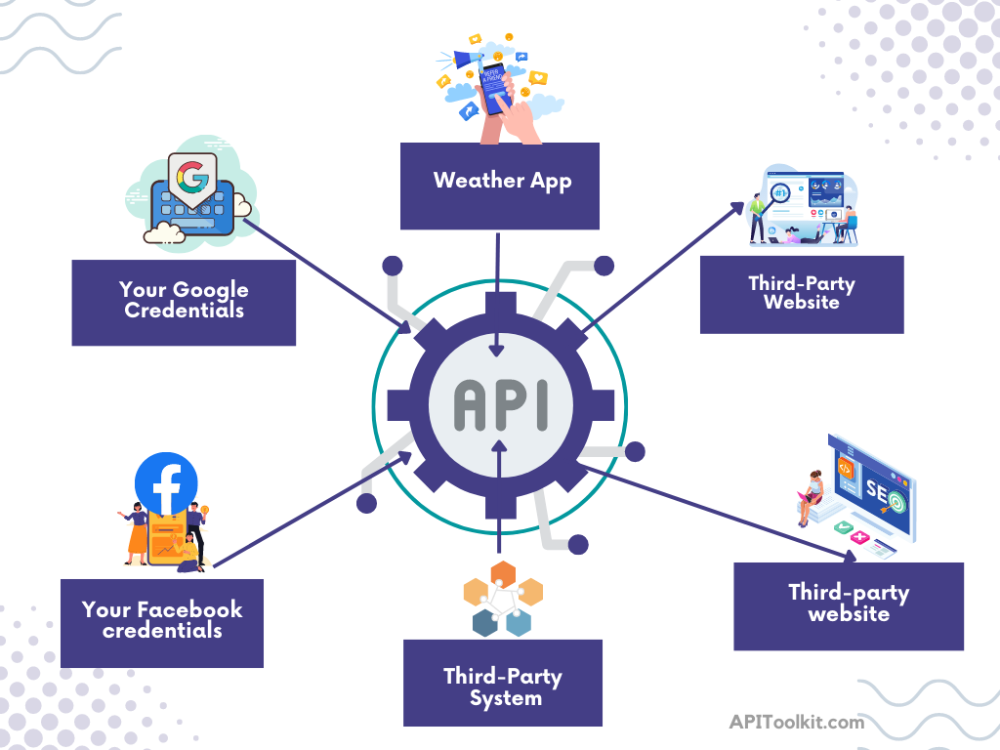
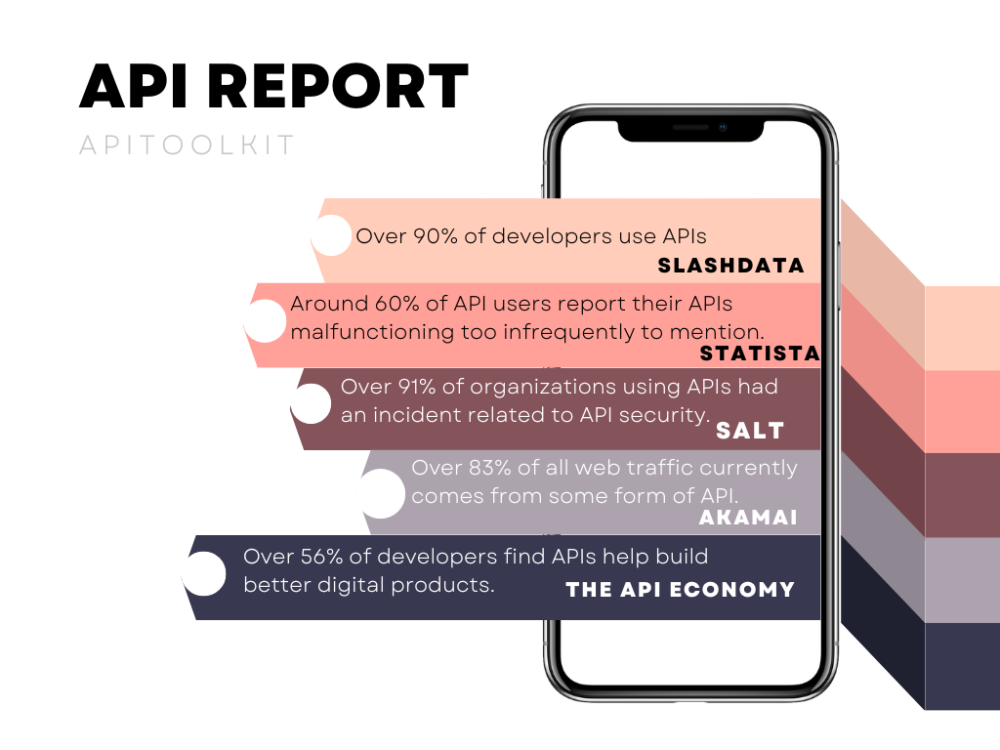
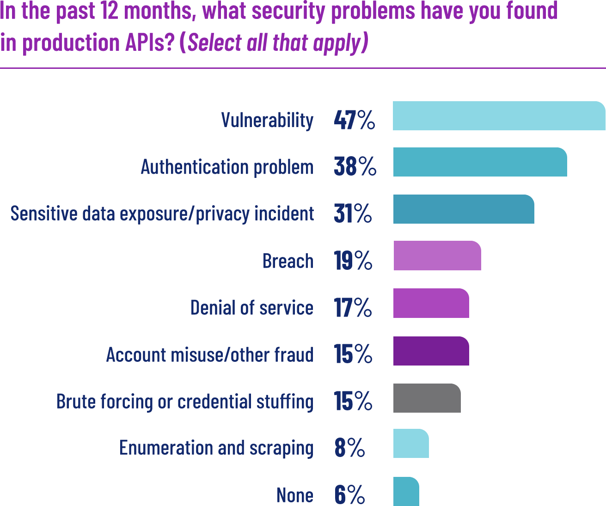
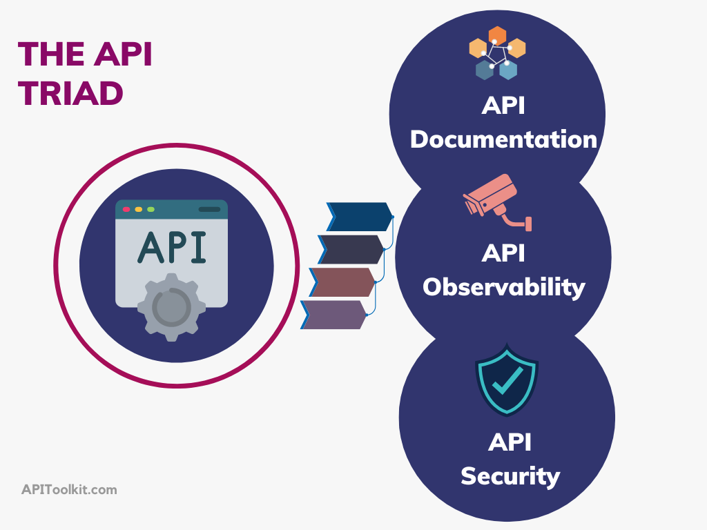

---
title: "API Documentation and Observability: The Truth You Must Know"
date: 2023-02-15T18:36:58+02:00
author: collins
description: "API Documentation and Observability: The Truth You Must Know"
categories:
  - API Observability
--- 

Connectivity is one fantastic thing that has put the world at our fingertips, and technology has made this even easier with the use of APIs. The technology stack behind API documentation and observability has ensured secure and reliable connectivity across a vast chain of programs. APIs have made lives more manageable.

How do you think apps and websites let you create an account and log in with your Facebook or Google credentials? Or how do weather apps get the day’s forecast? The answer to both questions is that they talk to other systems to get the data or verify your credentials. These two systems talk to each other through an API or Application Programming Interface.

## What is an API?

In simple terms, an API (Application Programming Interface) is a software intermediary that allows two applications to interact with each other, handling requests and returning the appropriate data. It’s a messenger that takes requests from one application to another; tells it what you want to do, and then returns a response back to you.

According to [Forbes](https://www.forbes.com/sites/googlecloud/2022/01/19/research-shows-api-management-fuels-growth-heres-why/?sh=4f258ac51713), the market capitalization of companies that have adopted APIs has grown by more than 12% compared to those that have not adopted APIs. And [RapidAPI](https://research.aimultiple.com/api-statistics/) states that more than 90% of executives describe APIs as mission-critical.

Over 90% of programmers use APIs.

APIs have created the connectivity that puts the world at our fingertips.

## Key Components of an API

APIs have the following standard key components:

- **Endpoint:** A specific URL that represents and/or serves as a point of entry to a resource during an API call.

- **Request:** An action made to an API endpoint, usually including a method (e.g. GET, POST) and any necessary parameters.

- **Response:** The data returned by an API in response to a request, typically in a format such as JSON or XML.

- **Authentication:** A process that verifies the identity of a client making a request to an API.

- **Authorization:** A process that determines whether a client has the necessary permissions to access a requested resource.

- **HTTP status codes:** Codes returned by an API in response to a request, indicating the success or failure of the request (e.g. 200 OK, 401 Unauthorized).

- **Documentation:** Information that explains how to use an API, including a description of its endpoints, request format, and expected responses.

## API Documentation

APIs have become increasingly important in recent years as they allow different software systems to communicate with each other and exchange data. They have been widely adopted across various industries such as technology, healthcare, finance, and more. However, behind the successful use of an API to send and receive requests is API documentation.

### What is API Documentation?

API documentation is a crucial aspect of software development that provides information about the functionality and use of an application programming interface (API). It serves as a reference for developers who want to integrate their applications with the API and for users who want to understand how to use the API effectively.

### Why is API Documentation Important?

API documentation plays a vital role in ensuring that an API is easy to understand and use. It’s the equivalent of a primer or product guide. API documentation helps to bridge the gap between the API creators and API users by providing clear and concise information about the API’s capabilities, inputs, outputs, and error handling.

Also, API documentation helps to increase the adoption of an API, as it enables developers to quickly and easily integrate their applications with the API. This leads to increased productivity and reduced development time, as developers don’t have to spend time figuring out how the API works.

As a standard practice, your API documentation should be as detailed as possible.

Take for instance, a developer is using an API to retrieve data from a database. If the API documentation includes detailed descriptions of the endpoints, request and response structures, and error codes, the developer can quickly understand how the API works and what to expect when they make requests.

However, if the documentation doesn't include this information, the developer may struggle to figure out why they're not getting the expected results, leading to frustration and wasted time and resources.

Ensuring that your API documentation is well-detailed and easy to understand increases your patronage and revenue.

### Essential Elements of API Documentation

1. Endpoints: A clear and comprehensive list of all the endpoints that the API offers.
2. Request and Response examples: Detailed examples of the requests and responses for each endpoint, including the expected input parameters, output format, and response codes.
3. Error handling: Information about the error codes and messages that the API may return and the conditions that trigger them.
4. Authentication and authorization: Information about the authentication and authorization mechanisms supported by the API.
5. Security: A description of the security measures that the API has in place to protect sensitive data.
6. Rate limits: Information about the rate limits for each endpoint, including the maximum number of requests per unit of time.
7. SDKs and code samples: Code samples and software development kits (SDKs) that make it easier to integrate with the API.

### API Documentation Best Practices

Creating highly useful API documentation requires intelligent effort and strategy. Below are some key things you should take cognizance of:

1. Use clear and concise language: You should write your API documentation in a clear, concise, and easy-to-understand manner, using plain language and avoiding loads of technical jargon.
2. Keep it up-to-date: Regularly update API documentation to ensure that it remains accurate and relevant.
3. Make it accessible: Ensure that API documentation is easily accessible, either through a dedicated documentation portal or through the API itself.
4. Use examples: Use examples and code snippets to help developers understand how to use the API.
5. Make it visually appealing: Use graphics, tables, and other visual elements to make the API documentation more appealing and easier to understand.
6. Document all endpoints and parameters: Make sure your API documentation lists all endpoints and parameters. This includes the endpoint URL, HTTP method (GET, POST, PUT, etc.), request parameters, and response format. It's also important to specify any constraints or limitations on the use of the API, such as rate limits.
7. Provide error codes and messages: Your API documentation should also include a list of all error codes and messages that may be returned by the API. This helps developers understand what went wrong and how to fix the problem.

API documentation plays a crucial role in the success of any API. It is the face of the API and the first point of contact between the API provider and its consumers. Taking a meticulous effort to write clean API documentation can make your API easy to understand and use, resulting in increased adoption and satisfaction among developers.

## API Documentation and Observability

Gone are the days of just writing or following API documentation and calling it a wrap.  If your API connectivity is of any importance to you, then you have to make API observability an integral part of your API framework.

Nowadays, API documentation and observability go hand-in-hand.

Observability plays a crucial role in API documentation as it helps developers understand API behavior and how it can be used in different scenarios. Observability provides visibility into the API's performance, errors, and usage patterns. This helps developers and enterprises quickly diagnose and resolve issues, leading to improved overall API reliability and user satisfaction.

In API documentation, observability can be achieved through detailed descriptions of the API's endpoints, request and response structures, error codes, and response times. Additionally, monitoring and logging tools can be used to track the API's performance, availability, and usage patterns in real time.

## API Observability and Monitoring in a Risky Ecosystem

Although API has become an essential component of many brands in our vastly competitive and digital world, it comes with its own risks. Hence, the need to deploy API observability and monitoring mechanisms for effective security and performance.

According to a [Salt](https://salt.security/api-security-trends?) API security survey, 94% of responders indicated that they had experienced API security problems.

In addition to API security, API observability and monitoring can serve as your API performance management agent, verifying that your payloads are returning the correct data and notifying you of any changes. It can also provide you with real-time analytics concerning user behavior.

An efficient [API observability and monitoring tool](https://apitoolkit.io/blog/best-api-monitoring-and-observability-tools/) will help you build and maintain your APIs with less downtimes, spotting broken/slow API endpoints, missing/incorrect data, etc., before your customers. This helps you secure brand patronage and customer loyalty.

Also, not forgetting that a loyal customer keeps you on the job.

According to [Gartner](https://blogs.gartner.com/andrew-lerner/2014/07/16/the-cost-of-downtime/), the average cost of IT downtime is $5,600 per minute, which extrapolates to well over $300,000 p/hour. It's hard to predict when and where APIs will fail. This was why we built [APIToolkit](apitoolkit.io) – to solve API downtimes and security issues.

API-related downtimes have affected [big companies](https://www.insightsforprofessionals.com/it/leadership/famous-business-outages) as large as Amazon, Facebook, Discord, etc. No one is above API breakage. But you can definitely stay alert using [APIToolkit’s observability and monitoring tools](https://apitoolkit.io/).

## Major Causes of API Downtime

Any company, big or small, may suffer API downtime at some point, resulting in revenue loss and lost customer trust. This is generally bad for business. 

Discussed below are some of the major factors that cause API downtimes:

1. **Server failure:** The physical or virtual servers hosting the API can fail, leading to an API downtime.

2. **Network issues:** Network issues such as congestion, routing problems, and data loss can lead to API downtime.

3. **Traffic spikes:** If an API is not designed to handle high volumes of traffic, it may become unavailable or slow down during periods of high usage.

4. **Resource exhaustion:** When an API is overwhelmed by too many requests, it can lead to resource exhaustion and API downtime.

5. **Configuration errors:** Improper configuration of the API or its dependencies can cause the API to fail or become unavailable.

6. **Code bugs:** Coding errors or bugs in the API can lead to downtime.

7. **Maintenance or upgrades:** Scheduled or unscheduled maintenance or upgrades to the API or its dependencies can cause the API to become unavailable temporarily.

8. **Security incidents:** Security incidents such as DDoS attacks, hacking, and other malicious activities can cause an API to become unavailable or slow down.

9. **Dependencies:** If an API depends on other services or databases to function, failures in these dependencies can result in API downtime.

10. **Configuration errors:** Misconfigured servers, firewalls, or databases can cause an API to become unavailable.

11. **Human error:** Accidental deletion of files, incorrect changes to configurations, and other human errors can cause an API to fail.

### The Real Cost of API Downtimes

API downtimes can have a significant impact on businesses and organizations that rely on API services for critical operations. When APIs fail, in most cases the following is at stake:

- Additional costs for businesses, such as the cost of fixing the issue.
- The cost of lost productivity. 
- The cost of providing compensation to affected customers. 
- In some cases, downtime can result in legal repercussions, such as lawsuits or penalties for breach of contract.
- The cost of damage to brand reputation

Moreover, API downtimes can also have a negative impact on the development of new applications and services, as developers may be unable to access the API they need to build their solutions. This can slow down the pace of innovation and prevent new products and services from reaching the market.

Additionally, API downtimes can also impact the reputation of the API provider. Let’s say an API provider experiences repeated downtimes, it can damage its reputation and lead to a loss of trust from its customers and partners.

### Our Founder’s API Downtime Story

Our founder, [Anthony Alaribe](https://twitter.com/tonialaribe), once had an excruciating experience with API downtime. This, eventually, led to the birth of APIToolkit.

Hear him out:

> A few years ago, I was a new hire at a food delivery company, migrating a legacy service from PHP to Golang. We implemented the fields listed in the swagger docs, and compared the responses from the legacy service to the responses of the new service, fixing differences until everything matched.
>
> After weeks of implementation and testing, we rolled out the new service after running tests to make sure everything worked as expected. But immediately we looked at our order monitoring charts, we knew we had messed up. Within 10 minutes, 20k orders were lost. I was terrified! What happened?
>
> Apparently, in a couple of countries we ran in, a particular field that was expected by the apps was no longer being sent, preventing the placing of orders. We had no idea since this field was not in the inherited documentation, and was only applicable in a couple of countries that were not part of the samples we manually tested.
>
> We rolled back and fixed the issue, but I was sad that there was no tool that could have detected this issue faster.
>
> Years later, this is that tool (APIToolkit), and we would love to listen to similar stories you’ve experienced and help make such stories a thing of the past.

[Try APIToolkit for Free](apitoolkit.io)

### Benefits of an API Observability and Monitoring Tool

As more and more companies have recognized the importance of API observability, it has become a standard in the tech industry. Below are some key benefits of using an API observability and monitoring tool:

**Real-time monitoring:** Allows you to monitor API performance in real time, detect issues early, and resolve them before they impact the user experience.

**Improved performance:** By identifying bottlenecks and other performance issues, you can optimize your APIs and improve their overall performance.

**Better visibility:** You can see detailed information about API calls, including request and response data, status codes, and response times, which can help you understand how your APIs are being used.

**Enhanced Security:** By monitoring the traffic flowing through your APIs, you can identify potential security threats and take proactive measures to mitigate them.

**Error tracking:** The tool can track and alert you to any errors that occur in your API calls, allowing you to resolve them quickly and prevent them from affecting your customers.

**Trend analysis:** You can use the tool to track usage patterns, monitor growth and identify trends, which can help you make data-driven decisions about how to improve your products.

**Faster Troubleshooting:** The ability to quickly track down issues, determine their root cause, and resolve them can greatly reduce downtime and minimize the impact of outages on your customers.

**Improved customer experience:** By ensuring your APIs are running smoothly and providing a high-quality experience, you can build customer trust and loyalty.

**Better collaboration:** The tool can provide a centralized view of API performance, making it easier for teams to work together and resolve issues more quickly.

### Companies that Use API Observability Tools

**[Netflix]**(https://www.netflix.com/): Netflix uses an API observability tool to monitor the performance and usage of its streaming APIs. This helps them ensure the quality of their service and identify any issues quickly.

**[Dropbox]**(https://www.dropbox.com/home): Dropbox uses an API observability tool to monitor the performance of its file storage and sharing APIs. This allows them to proactively address any performance issues and ensure a seamless user experience.

**[Twilio]**(https://www.twilio.com/): Twilio uses an API observability tool to monitor the performance of its communication APIs. This helps them detect and resolve any issues related to their messaging, voice, and video services.

**[PayPal]**(https://www.paypal.com/): PayPal uses an API observability tool to monitor the performance of its payment processing APIs. This allows them to ensure the reliability of their service and detect any potential security threats.

**[Amazon]**(https://www.amazon.com/): Amazon uses an API observability tool to monitor the performance of its e-commerce APIs. This helps them ensure the reliability of their service and quickly detect any issues.

**[Uber]**(https://www.uber.com/): Uber uses an API observability tool to monitor the performance of its ride-hailing APIs. This helps them detect and resolve any issues related to their mapping, dispatch, and payment services.

**[Slack]**(https://slack.com/): Slack uses an API observability tool to monitor the performance of its messaging APIs. This allows them to ensure the quality of their service and detect any performance issues.

**[Airbnb]**(https://www.airbnb.com/): Airbnb uses an API observability tool to monitor the performance of its vacation rental APIs. This helps them detect and resolve any issues related to their property listings, bookings, and payments.

**[Salesforce]**(https://www.salesforce.com/): Salesforce uses an API observability tool to monitor the performance of its customer relationship management (CRM) APIs. This helps them ensure the reliability of their service and detect any issues related to their sales, marketing, and support processes.

**[Spotify]**(https://www.spotify.com/): Spotify uses an API observability tool to monitor the performance of its music streaming APIs. This helps them ensure the quality of their service and detect any issues related to their playlist recommendations, song search, and playback.

**[Google]**(http://google.com): Google uses API observability tools to monitor the performance of its cloud computing APIs. This helps them ensure the reliability of their services and detect any issues related to data storage, computing power, and network connectivity.

**[Facebook]**(http://facebook.com): Facebook uses API observability tools to monitor the performance of its social media APIs. This helps them ensure the quality of their service and detect any issues related to user profiles, posts, and notifications.

**[Microsoft]**(https://www.microsoft.com/): Microsoft uses API observability tools to monitor the performance of its productivity and collaboration APIs. This helps them ensure the reliability of their services and detect any issues related to email, documents, and project management.

**[LinkedIn]**(https://www.linkedin.com/): LinkedIn uses API observability tools to monitor the performance of its professional networking APIs. This helps them ensure the quality of their service and detect any issues related to job postings, candidate searches, and skill endorsements.

**[Stripe]**(https://stripe.com/): Stripe uses API observability tools to monitor the performance of its payment processing APIs. This helps them ensure the reliability of their service and detect any issues related to credit card transactions, invoicing, and subscriptions.

#### Conclusion

APIs have become an important technology for companies looking to remain competitive in an increasingly digital world. What’s more, proper API documentation and observability are crucial components for building and maintaining successful APIs.

By prioritizing these areas, organizations can ensure their APIs are reliable, scalable, and meet the needs of their users.

Also, API observability and monitoring will help your company stay on top of API usage and performance, allowing you to quickly respond to any changes or issues that arise. Investing in API observability and monitoring is essential for organizations looking to deliver high-quality APIs that meet the needs of their users.

Therefore, whether you are making an API connection, building a new API, or looking to improve an existing one, you should not overlook the importance of API documentation, observability, and monitoring.

[Try APIToolkit for Free](apitoolkit.io)