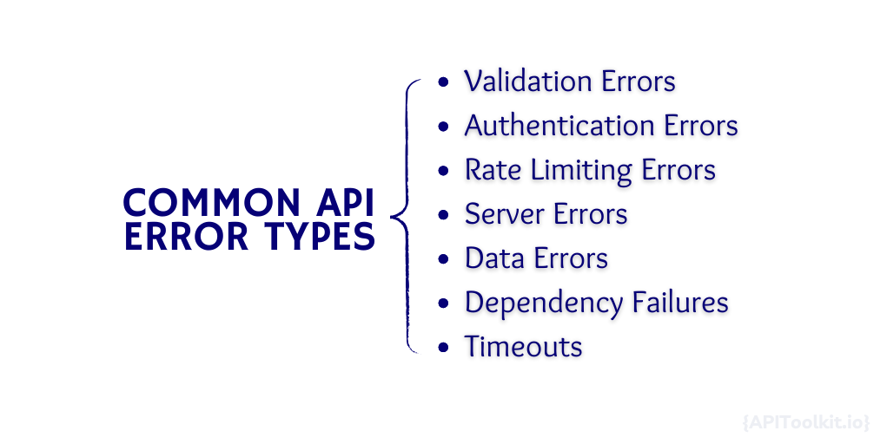

The contemporary business environment deeply relies on Application Programming Interfaces (APIs). These interfaces are fundamental in integrating various systems and are the driving force behind the functionalities of current apps, serving as the invisible yet essential elements that ensure the digital ecosystem operates without a hitch. The necessity for an [API](https://apitoolkit.io/blog/efficient-endpoint-troubleshoot/) to function smoothly is critical. But what transpires when unforeseen errors surface? Challenges like performance setbacks, service interruptions, or even full-scale outages can precipitate not only a decline in revenue but also a tarnished brand image.

### The Importance of API Monitoring

While [APIs](https://apitoolkit.io/blog/importance-of-streamlining-navigations/) act as conduits for information between various systems, it's essential to understand that these conduits require consistent surveillance. Imagine an API as a vital artery in a living organism, the body. Just as arteries need to be monitored to prevent blockages and ensure a steady flow of blood, [APIs](https://apitoolkit.io/blog/importance-of-streamlining-navigations/) require similar oversight to guarantee the uninterrupted flow of data. A comprehensive [API monitoring](https://apitoolkit.io/blog/mastering-monitoring/) system goes beyond mere error identification; it offers foresight into possible issues, assists in diagnostic processes, and contributes to enhancing performance. Essentially, API [monitoring](https://apitoolkit.io/blog/mastering-monitoring/) transcends basic fault detection; it's a forward-thinking strategy to maintain peak functionality and avert potential disruptions.

In the sections that follow, we'll delve deep into the world of API errors – understanding their types, implications, and, most importantly, prevention strategies. By equipping you with the right tools and best practices, we can transform our API [monitoring](https://apitoolkit.io/blog/mastering-monitoring/) approach from a reactive one to a proactive one. Let's embark on this journey and discover how to make our APIs not just functional but exceptional.

## Understanding API Errors

[APIs](https://apitoolkit.io/blog/monitor-api-slas-and-slos/), by their very nature, are interfaces that allow software components to communicate. However, like any other form of communication, there's room for misinterpretation, delays, and outright failures. API errors can be a manifestation of these communication hitches. But what types of errors are we talking about, and what implications do they have?

### Common API Error Types

1. **Validation Errors**: These occur when the input to an API does not meet expected formats or constraints. For example, passing a string where a number is expected.

2. **Authentication and Authorization Errors**: Errors like `401 Unauthorized` or `403 Forbidden` arise when there's a problem with the credentials or permissions related to the [API](https://apitoolkit.io/blog/monitor-api-slas-and-slos/) call.

3. **Rate Limiting Errors**: If an API consumer sends too many requests in a short period, it might hit rate limits, leading to errors such as `429 Too Many Requests`.

4. **Server Errors**: Represented by the infamous `500 Internal Server Error`, these errors occur when the server faces issues it can't resolve on its own.

5. **Data Errors**: These happen when expected data is missing, corrupted, or in an unexpected format.

6. **Dependency Failures**: [APIs](https://apitoolkit.io/blog/monitor-api-slas-and-slos/) often rely on other services. If a dependent service fails, it can cascade as an error in the API.

7. **Timeouts**: When an API call takes too long, it might time out, causing delays or failures in the systems that depend on it.

### Implications of Ignored Errors

Ignoring API errors can have a range of consequences:

1. **Service Interruptions**: Even a minor error can cause service interruptions, leading to user frustration and loss of trust.

2. **Data Corruption**: If errors aren't managed properly, they can lead to data being saved incorrectly or not saved at all.

3. **Performance Degradation**: Errors like memory leaks can degrade performance over time, slowing down systems until they eventually crash.

4. **Financial Impacts**: Especially in eCommerce or Fintech applications, API errors can lead to financial losses due to failed transactions.

5. **Reputation Damage**: Frequent errors and outages can tarnish a company's reputation, leading to a loss of users or customers.

Understanding API errors is the first step in addressing them. It's not just about recognizing that an error occurred but about comprehending its nature, cause, and potential impact. With this foundation, organizations can move to the next step: setting up robust monitoring systems to detect, alert, and mitigate these errors.

## Key Components of Effective API Monitoring

In an age where even a minor service disruption can lead to significant user dissatisfaction, proactive monitoring of APIs becomes crucial. But what makes monitoring truly effective? Let's explore the essential components that organizations should incorporate into their API monitoring strategies.

### Real-time Monitoring

**Importance**:  
APIs are real-time bridges of communication. Therefore, monitoring them should also be in real-time. The faster you can detect an anomaly, the quicker you can react, ensuring minimal impact on the user experience.

**Implementation**:  
Utilize tools that offer real-time dashboards and instant notifications. These tools should be able to analyze API calls as they happen and immediately highlight deviations from the norm.

### Historical Data Analysis

**Importance**:  
While real-time data provides immediate insights, historical data offers context. Analyzing trends over time can help in identifying recurring issues, predicting potential future problems, and understanding user behavior patterns.

**Implementation**:  
Ensure your [monitoring](https://apitoolkit.io/blog/rum-vs-synthetic-monitoring/) solution retains data over extended periods, allowing for trend analysis. Employ visualization tools that can represent this data in an understandable format, such as graphs or heat maps.

### Threshold-based Alerts

**Importance**:  
Not every deviation is worth a panic. Setting thresholds means you're alerted only when certain predefined conditions are met, ensuring you're not overwhelmed by false alarms.

**Implementation**:  
Define what "normal" looks like for your API - this could be based on response times, error rates, or any other relevant metric. Set alerts to trigger when deviations from these norms occur.

## APIToolkit as a Monitoring Tool

Choosing the right [monitoring](https://apitoolkit.io/blog/mastering-api-debugging/) solution is crucial. While built-in tools offer the convenience of integration and platform optimization, they often fall short when it comes to advanced features and scalability, especially in complex, multi-platform environments. On the other hand, third-party solutions bring sophistication and extensive capabilities but can pose challenges in integration and cost. Herein lies the significance of APIToolkit, a tool that encapsulates the best of both worlds.

**1. Comprehensive Feature Set:**
[APIToolkit](https://apitoolkit.io/) mirrors the advanced features of third-party monitoring solutions, offering extensive monitoring capabilities. From tracking your API changelogs to monitoring those of APIs you depend on, it provides a holistic view of your API environment. Its ability to track error rates, latency, and other performance indicators ensures that you're not just spotting issues but also understanding your API's behavior and performance trends.

**2. Ease of Integration:**
Despite being a third-party solution, APIToolkit is designed for ease of integration, much like built-in tools. It acknowledges the diverse ecosystems in which modern APIs operate and offers a seamless experience, reducing the time and technical effort typically associated with integrating third-party solutions.

**3. Best Practices and Standards Enforcement:**
Beyond mere monitoring, [APIToolkit](https://apitoolkit.io/) emphasizes the quality and consistency of your APIs. The linting feature evaluates your APIs against best practices and team conventions, a proactive approach to quality assurance that built-in tools often lack.

**4. Cost-Effectiveness:**
While third-party tools can be expensive, APIToolkit recognizes the need for cost-effective solutions that don't compromise on functionality. It offers competitive pricing structures suitable for various business sizes and requirements, ensuring you get advanced [monitoring](https://apitoolkit.io/blog/rum-vs-synthetic-monitoring/) without overstretching your budget.

**5. Scalability and Flexibility:**
APIToolkit is designed with scalability in mind, capable of accommodating growth and changes in your API strategies. Its flexibility means it can monitor APIs across various platforms, a crucial requirement for businesses looking to expand or diversify.

In the search for [monitoring](https://apitoolkit.io/blog/rum-vs-synthetic-monitoring/) tools that offer effective solutions, APIToolkit stands out as a potent option, operating as an efficient hybrid system. Its amalgamation of wide-ranging features, seamless integration, adherence to best [practices](https://apitoolkit.io/blog/web-api-performance/), cost efficiency, and flexibility makes it the preferred choice for businesses seeking thorough and robust API monitoring solutions. Discover an easier way to monitor APIs with [APIToolkit](https://www.apitoolkit.io).

## Best Practices for Error Detection and Response

In API management, merely reacting to problems isn't enough; it's crucial to adopt a proactive stance to genuinely guarantee steady performance and dependability. The best [practices](https://apitoolkit.io/blog/web-api-performance/) outlined below stem from years of accumulated expertise in the industry, with the goal of shifting the strategy from simple error identification towards effective error prevention and handling.

### Setting Up Meaningful Alerts

**Why It's Crucial**:  
The barrage of insignificant alerts can quickly lead to "alert fatigue", causing teams to ignore or overlook critical notifications.

**How to Implement**:  
- **Prioritize Alerts**: Classify alerts based on their criticality.
- **Consolidate Similar Alerts**: Use tools that bundle similar alerts to avoid redundant notifications.
- **Review and Refine**: Regularly review the alert logic to minimize false positives.

### Anomaly Detection Techniques

**Why It's Crucial**:  
Not all issues will breach predefined thresholds. Anomaly detection identifies unusual patterns that might indicate potential problems.

**How to Implement**:  
- **Machine Learning**: Use tools that employ ML algorithms to learn "normal" behavior and flag deviations.
- **Statistical Analysis**: Implement statistical models to identify outliers in your data.

### Creating an Incident Response Plan

**Why It's Crucial**:  
When a major issue arises, chaos can ensue. An incident response plan provides a structured approach to manage and resolve the issue.

**How to Implement**:  
- **Clear Roles & Responsibilities**: Designate who will take charge, communicate updates, and liaise with different teams.
- **Communication Channels**: Determine how updates will be communicated to stakeholders, teams, and users.
- **Post-mortem Analysis**: After resolution, analyze what went wrong, how it was handled, and how to prevent recurrence.

### Continuous Feedback Loop

**Why It's Crucial**:  
Feedback, whether from end-users or internal teams, is invaluable. It can provide insights into issues that might not be captured by automated tools.

**How to Implement**:  
- **Feedback Channels**: Set up easy-to-use channels for users to report issues or provide feedback.
- **Act on Feedback**: Ensure feedback is not just collected but acted upon, refining monitoring strategies accordingly.

### Automation in Error Management

**Why It's Crucial**:  
In today's fast-paced tech landscape, automation can provide rapid response times, often resolving issues before they impact users.

**How to Implement**:  
- **Auto-Rollbacks**: If a new deployment causes issues, automate the process to rollback to the last stable version.
- **Self-healing Systems**: Implement systems that can automatically address minor issues, like restarting a failed service.

### Test in Real-world Scenarios

**Why It's Crucial**:  
Simulated environments often differ from real-world scenarios. Regular testing in production-like environments can offer more accurate insights.

**How to Implement**:  
- **Load Testing**: Simulate high traffic loads to identify potential bottlenecks.
- **Chaos Engineering**: Introduce deliberate failures to understand system resilience and potential weaknesses.

Embracing these best practices can drastically reduce the occurrence of API errors and enhance the response when they do occur. The ultimate goal is to ensure a seamless experience for users, building trust and reliability around your services.

## Conclusion

The increasing adoption of microservices, the rise of edge computing, and the burgeoning IoT (Internet of Things) landscape will only make the API ecosystem more complex. However, with challenges come opportunities. Advances in machine learning and artificial intelligence promise smarter [monitoring](https://apitoolkit.io/blog/rum-vs-synthetic-monitoring/) tools, capable of predictive analytics and even more nuanced anomaly detection. Automation will continue to play a significant role, not only in error detection but in resolution, with systems capable of self-diagnosis and repair. While the landscape of API management is certain to change, the principles of vigilance, proactiveness, and continuous improvement will remain constant. As long as we keep these principles at the forefront, we can navigate the complexities of the API world, ensuring robust, high-performing, and reliable systems for all.

## Keep Reading

[How to Analyze API Logs and Metrics for Better Performance](https://apitoolkit.io/blog/api-logs-and-metrics/)
[Comprehensive API Management Strategies for Businesses](https://apitoolkit.io/blog/the-ultimate-api-management-strategy/)
[Top 8 Documentation Tools for Developers](https://apitoolkit.io/blog/top-8-api-documentation-tools-for-developers/)
[Top 7 Reasons Why Your Team Should Use an API Monitoring Tool](https://apitoolkit.io/blog/why-you-need-an-api-monitoring-tool/)
