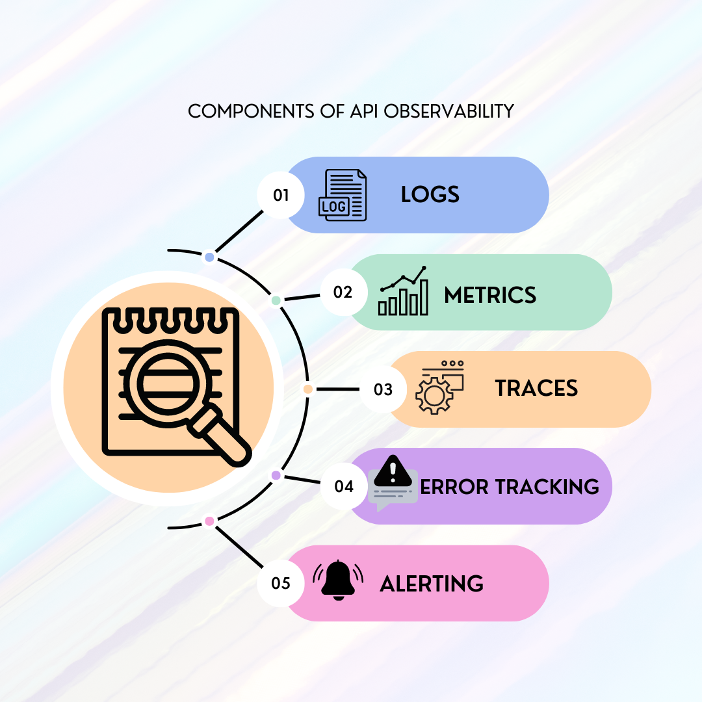
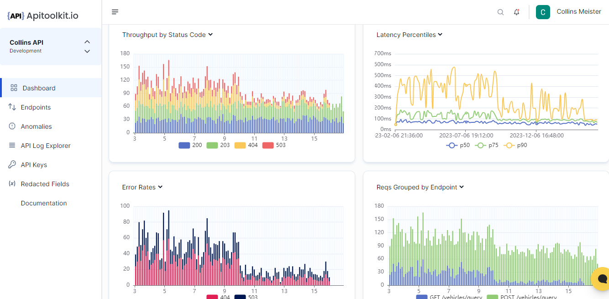
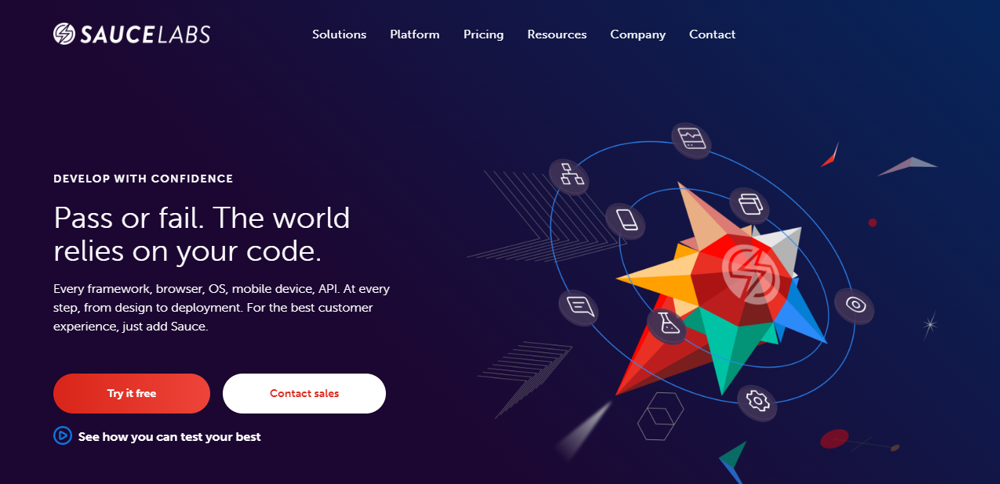
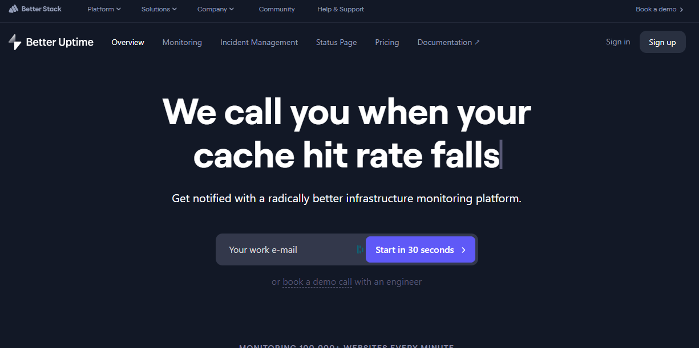
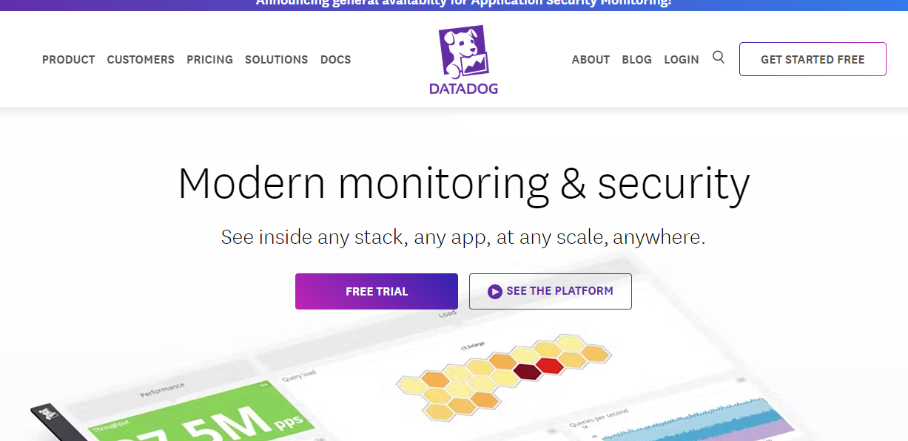
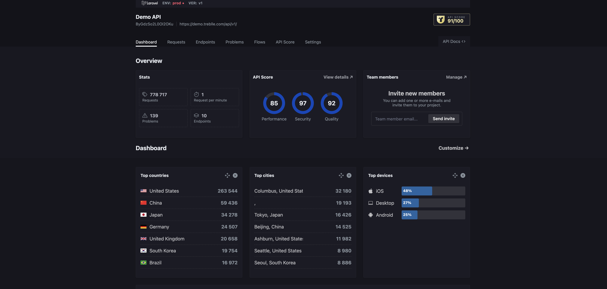

---
title: "Best API Monitoring and Observability Tools in 2023"
date: 2023-01-02T18:36:58+02:00
author: collins
description: Find out what the best API observability tools are to keep your APIs functioning optimally
categories:
  - API Observability
--- 

With [API observability](https://apitoolkit.io/blog/what-is-api-testing/), out of sight shouldn’t mean out of mind. APIs work in the background using simple commands to move requests back and forth. Perhaps because they do a lot of background work, QA teams tend to neglect them.

API observability is an underrated yet hugely important aspect of [quality assurance testing](https://apitoolkit.io/blog/api-testing-automation). One shouldn’t wait until a downtime occurs before jumping to fix broken or missing APIs.

## What is an API?

An API serves as a liaison between various software programs, enabling them to talk to one another and share data. This is similar to a waiter in a restaurant who takes your order and then relays it to the kitchen and returns with your requested meal.

When you use an app on your phone or computer, it frequently has to make a request for data from a web server. Such communication is made possible by the API. It offers a set of guidelines and procedures for how various software applications can communicate with one another.

For instance, if you use a weather app, it might use an API to ask a web server for the current weather data. The API provides a standard way for the app to make that request and receive the data it needs.

## What is API Observability?

API observability is a comprehensive practice that revolves around the systematic gathering, processing, and interpretation of data emanating from an Application Programming Interface (API). The primary aim of API observability is to acquire valuable insights into the API's [performance metrics](https://apitoolkit.io/blog/web-api-performance/), availability, and overall usage patterns. Diligently monitoring and scrutinizing this data ensures that developers and system administrators can effectively identify, diagnose, and rectify various issues and anomalies that may arise during the API's lifecycle.

API observability is a more comprehensive approach to monitoring than [traditional API monitoring](https://apitoolkit.io/blog/api-documentation-and-observability-the-truth-you-must-know/). Traditional monitoring typically focuses on [collecting metrics](https://apitoolkit.io/blog/api-logs-and-metrics/) such as request latency, error rate, and throughput. API observability, on the other hand, collects a wider range of data, including logs, traces, and metrics. This data can be used to gain a deeper understanding of how an API is performing and how it is being used.

Moreover, API observability paves the way for real-time monitoring and alerting mechanisms, ensuring that any deviations from expected behavior are promptly flagged, enabling proactive responses to potential issues before they escalate. This proactive approach significantly reduces downtime and improves overall system reliability.

By using advanced data visualization techniques, such as dashboards and analytics tools, API observability empowers dev teams to interpret complex datasets effectively. This in turn helps them make data-driven decisions and devise strategies for enhancing the API's performance, bolstering its scalability, and fine-tuning its overall behavior.

Read: [Must-Know API Trends in 2023](https://apitoolkit.io/blog/api-trends/)

### Best API Monitoring and Observability Tools

We’ve curated a list of the best API observability and monitoring tools to help make your QA processes seamless and improve your [API documentation](http://apitoolkit.io/blog/how-to-write-api-docs).

## 1. [APIToolkit](http://www.apitoolkit.io)

Built by expert software engineers to solve problems that have cost their employers lots of money in the past, APIToolkit is an automated tool for API contract monitoring and documentation. 

Using best-in-class technology, APIToolkit leverages a highly specialized and powerful platform to provide a secure environment for developers to build and maintain APIs with enhanced analytics.

APIToolkit spots broken APIs, changed fields, etc., before your customers.

**Features:**
- **Real time updates to API docs (auto-generated):** View your live API shapes, fields, etc and generate swagger docs at anytime via your live taffic. Say goodbye to tedious manual documentation.
- **Live API Contract monitoring & alerts:** Keep up with any changes to your API. New fields, new endpoints, empty fields, change in field types, etc
- **Refactor and Migrate Safely:** Catch any bug and changes due to refactorings or migrations, faster than your customers.
- **View your API analytics in one place:** Response times, latency, etc. Run queries on your live api requests and responses.
- **API Testing**: Our API testing tool is designed to help you ensure the quality, functionality, and reliability of your APIs. It allows you to thoroughly test and validate various aspects of your APIs, including endpoints, request and response data, authentication mechanisms, error handling, and performance metrics.

Read: [Top 7 Reasons Why Your Team Needs an API Observability and Monitoring Tool](https://apitoolkit.io/blog/why-you-need-an-api-monitoring-tool/)

## 2. [Postman](http://www.postman.com)

Postman is a comprehensive API testing tool that needs no introduction. The platform offers API monitoring for a broad range of APIs including SOAP, REST, GraphQL, JSON, OpenAPI, Swagger, etc.

Postman uses Newman—a command-line Collection Runner—that enables users to run and test a Postman Collection directly from the command line.

Features:
- **Postman free plan:** Provides a maximum of 1000 calls to Postman API, Mock server calls, and monitoring API calls. Pricing starts at $12/month for the paid plan.
- **Offers custom domain.**
- **Offers training and onboarding.**

Read: [API Observability and Monitoring: What's the Difference?](https://apitoolkit.io/blog/api-observability-and-api-monitoring/)

## 3. [Saucelabs](https://saucelabs.com/platform)

Saucelabs is a continuous testing cloud-based platform that provides live, automated testing for web and mobile apps.

Features: 
- **Comprehensive coverage:** Up-to-date browser/OS combinations, mobile emulators & simulators, plus real device support
- **Scalable for CI/CD:** Teams of all sizes can check-in multiple pull requests throughout the day without queuing or bottlenecks, ensuring rapid feedback.
- **360 degrees UX testing:** Use your existing test scripts to gain a full view of functionality, front-end performance, and visual regressions, all on one platform.

## 4. [Better Uptime](http://www.betteruptime.com)

Better Uptime offers an API monitoring solution as a part of its complex Uptime Monitoring and Incident management solution. It isn’t specialized to API monitoring and so may not be the best for every user or team size.

#### Features:
- Unlimited phone call alerts: SMS, e-mail, Slack, Teams, and push notifications with its all-you-can-alert pricing.
- 30s multi-location checks: Each HTTP and ping-based incident is verified from at least 3 locations before alerting users.
- Incident management built-in: This alerts the right person on your team with Better Uptime’s on-call scheduling & plug in the services.

Read: [API Documentation vs API Specification: What It Means for You](https://apitoolkit.io/blog/api-documentation-vs-api-specification/)

## 5. [Moesif](https://www.moesif.com/) 

Moesif describes itself as “The API Experience Platform for Product-Led Growth”. It provides API analytics and tools to help users manage ther APIs.

#### Features:
- **Quickly activate customers:** Track funnel metrics like activation rate. 
- **Understand API usage:** Deeply understand who is using your APIs, how they are used, and payloads customers send.
- **Monetize APIs:** Implement usage-based pricing in a few clicks with billing meters.
- **Guide customers at scale:** Automatically inform customers at scale like exceeding quota limits and integration errors. 

## 6. [RapidAPI](https://rapidapi.com/)

RapidAPI is a platform that helps users find, connect to, and manage their APIs. It allows users to centralize and monitor worldwide operations under one roof and improve efficiency by CI/CD integration.

#### Features:
- **RapidAPI for free:** With 2 tests per API, 2000 API calls/month, and e-mail only notifications.
- **Integration into GitHub, PagerDuty, Slack, and Twilio.**
- **Solutions for an Integrated Developer Experience:** Improves developers’ experience with integrated tools for design, testing, monitoring, and more.
- **RapidAPI Enterprise Hub:** Your development teams, partners and customers can discover and connect to your APIs — all from a single, next-generation API Platform.

Read: [Key Benefits of API Integration for Developers](https://apitoolkit.io/blog/benefits-of-api-integration/)

## 7. [Datadog](https://www.datadoghq.com/)

Datadog’s API monitoring lets you automate site availability monitoring and reduce average time it takes to get to the cause. It also allows you to validate all the layers of your systems (from HTTP to DNS) from multiple geolocations, letting you focus on areas that are vital to your business by creating custom locations.

#### Features:
- **Datadog's API testing starts at $5/10k tests a month.**
- **Infrastructure Monitoring**
- **Log Management, Database, Network, and Serverless monitoring**

## 8. [Treblle](https://www.treblle.com/)

Treblle is a lightweight SDK designed for rapid API development, offering real-time monitoring, analytics, automated API documentation, and automated API security audits. It provides seamless integration with popular development tools and supports over 18 languages/frameworks.

**Features:**

**Real-time API Monitoring**: Keep track of API performance and availability instantly.

**Error Tracking and Alerts**: Identify and monitor API errors with customizable alerts.

**Performance Insights**: Obtain valuable insights into API performance for optimization.

**Debugging Tools**: Efficiently debug and resolve issues in API implementations.

**Integration Support**: Easily integrate Treblle with widely-used development tools.

**Historical Data Analysis**: Analyze historical trends for long-term performance improvements.

**Security Monitoring**: Detect and address potential vulnerabilities in API implementations.

**Documentation Generation**: Automatically generate up-to-date API documentation.

**Scalability and Reliability**: Ensure high scalability and reliability for large-scale API monitoring.

**User-friendly Interface**: Enjoy an intuitive interface for easy navigation and efficient monitoring."

**Also Read**

[Incident Management: How to Resolve API Downtime Issues Before It Escalates](https://apitoolkit.io/blog/api-downtime/)

[How to Generate Automated API Documentation](https://apitoolkit.io/blog/how-to-generate-automated-api-documentation/)

[How to Write API Documentation: 10 Essential Guidelines](https://apitoolkit.io/blog/how-to-write-api-docs/)

[How to Tackle Anomalies in RESTful APIs (the Right Way)](https://apitoolkit.io/blog/anomalies-in-restful-apis/)

***
Try APIToolkit [here](https://apitoolkit.io).