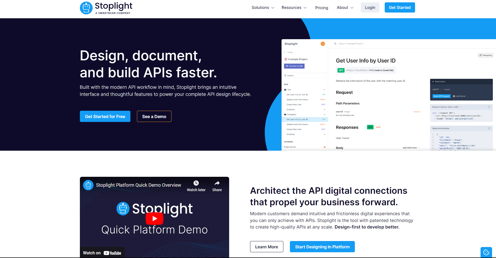
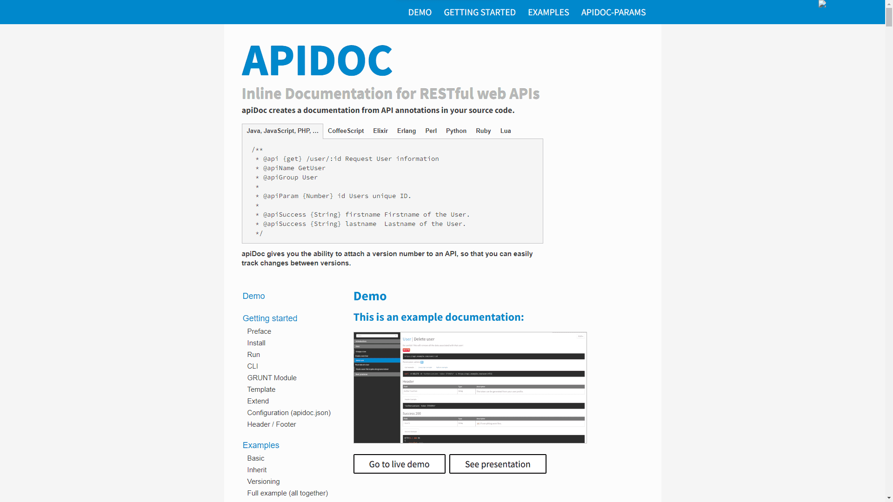

Application Programming Interfaces (APIs) have become the building blocks of modern digital experiences. However, even the most robust APIs are rendered ineffective if they lack clear and comprehensive documentation. This is where [API documentation](https://apitoolkit.io/blog/how-to-generate-automated-api-documentation/) tools come into play. These tools not only help developers create readable and user-friendly documents but also facilitate easier maintenance and updates. With a plethora of options available, choosing the right API documentation tool can be a daunting task.

When done right, API documentation serves as one of the most reliable sources of knowledge about how an [API](https://apitoolkit.io/) operates. It should include information on quickstarts, endpoints, parameters, and more in a well-organized format that is simple to grasp for both developers and non-technical users. It frequently contains tutorials and examples that will aid the user in understanding how various components of the API interact. In this article, we'll explore the top 8 [API documentation](/blog/api-documentation-vs-api-specification/) tools, examining their features, pros, and cons, to help you make an informed decision.

## Advantages of Documentation

Devoting the right amount of time and resources to producing high-quality API documentation, as an [API](https://apitoolkit.io/) company is very important, and here are the reasons why:

- Reduced Dependence on Support: Effective documentation frees up your API experts to focus on other tasks while assisting other users in solving their problems. It doesn't matter if your API is only utilized internally or by tens of thousands of users, this still holds.
- Encouraging Non-developers: Your API documentation enhances discussions about how your APIs and data may be used to achieve your business goals by expanding the expertise of non-coding colleagues.
- Long-Term Viability: Comprehensive documentation ensures that the API remains usable over time. As technologies evolve, developers can refer to the documentation to update their integrations and maintain compatibility.
- Speed: A detailed and easy-to-use API documentation speeds up the integration of your API by making it more accessible to new users and even returning users. 
- Increased User Satisfaction: Your company will benefit from having well-written and comprehensive API documentation because you will get satisfied clients who will be willing to send in referrals.
- User Onboarding: Clear documentation makes it easier for new users to onboard and start using the API quickly. This reduces the learning curve and encourages more developers to adopt the API.

## Importance of API Documentation for Developers

API documentation serves as the instruction manual for developers, providing essential details on how to effectively use and integrate an API. It covers aspects like endpoints, request/response types, authentication methods, and error codes. Good documentation can significantly reduce the learning curve for new developers and streamline the development process. In essence, well-documented APIs foster better collaboration, quicker adoption, and ultimately, successful implementation.

## What to Look for in an API Documentation Tool

When choosing an API documentation tool, there are several key factors to consider:

- User Experience: The tool should be intuitive and easy to navigate, allowing for quick document creation and updates. Features like "Try it out" buttons, which allow users to make API calls within the documentation, can enhance the user experience.
- Collaboration: Look for tools that enable multiple team members to collaborate in real-time, providing features like version control and comments.
- Customization: The ability to customize the look and feel of the documentation to align with your brand can be a significant advantage.
- Integration: Compatibility with existing systems or the ability to export documentation in various formats can be crucial for many organizations.

These factors help you select a tool that not only makes your API documentation more effective but also simplifies the development process.

## Basis of a good documentation

A good [documentation](https://apitoolkit.io/blog/how-to-generate-automated-api-documentation/) serves as a comprehensive guide for users and developers, facilitating understanding, implementation, and troubleshooting. Here are some fundamental elements that form the basis of good documentation:

1. **Clarity and Simplicity**: The language should be clear and straightforward. Avoid jargon or, if you must use it, provide explanations.

2. **Completeness**: All aspects of the subject should be covered. For APIs, this means information on endpoints, methods, parameters, and possible responses, among other things.

3. **Structure and Organization**: Well-organized documentation typically follows a structured format, starting with a table of contents, followed by introductions, main content sections, and a summary or conclusion. This flow aids in navigation.

4. **Searchability**: Users should be able to easily search for the information they are looking for, either through a search function or a well-organized index.

5. **Examples and Use-Cases**: Real-world examples and use-cases provide practical context, making complex topics more understandable. These examples help users apply the information effectively.

6. **Up-to-Date Information**: To remain relevant, documentation must keep pace with evolving technology. Outdated information can lead to confusion and inefficiencies, so regular updates are crucial.

7. **Accessibility**: The documentation should be easily accessible, whether it's online, downloadable as a PDF, or available in multiple formats.

8. **Visual Aids**: Diagrams, screenshots, and even videos can make complex topics much easier to understand.

9. **Interactivity**: In the context of API documentation, features like "Try it Out" buttons provide interactivity, allowing users to interact with the API directly. This hands-on experience aids in learning and testing.

10. **Feedback Loop**: Providing a means for users to give feedback on the documentation enables continuous improvements. Feedback ensures that the documentation remains effective and user-centric.

By incorporating these elements, you can create documentation that is not only informative but also user-friendly, aiding in quicker understanding and implementation.

## The Best API Documentation Tools

There are various widely available API documentation tools. These are a few:

### [Apitoolkit](https://www.apitoolkit.io/)

[APIToolkit](https://app.apitoolkit.io) offers a unique approach to API documentation by automating much of the process. It distinguishes itself with features that learn from live production traffic, allowing for real-time updates and issue detection. The tool also auto-generates Swagger or OpenAPI documentation, eliminating the need for manual YAML file creation, command-line tools, or code annotations. This level of automation makes it incredibly user-friendly and ensures that the documentation remains accurate and up-to-date. The key advantages of using [APIToolkit](https://app.apitoolkit.io) lie in its automation and real-time capabilities. By learning from live traffic, it ensures that your API documentation is always up-to-date and accurate. This not only saves an immense amount of time but also minimizes the risk of errors that can occur during manual documentation. In a field where precision and timeliness are paramount, [APIToolkit](https://app.apitoolkit.io) emerges as an invaluable tool for hassle-free, accurate API documentation.

### [Postman](https://www.postman.com/)

Postman's online API documentation tool can assist you in creating and maintaining machine-readable API documentation. Postman automatically gathers your sample requests, headers, code snippets, and more to populate your documentation with dynamic examples and machine-readable instructions. When you make changes to your collection, it also immediately updates your documentation. Postman's distinctive feature is its commenting system. Using this feature, you may submit comments and code reviews to share feedback and notify your coworkers of any changes or issues in real time.

### [Redocly](https://redocly.com/)

This is a developer documentation tool that creates API documentation based on the OpenAPI specification. It is a Visual Studio Code extension that assists you in creating, validating, and maintaining OpenAPI documents. It alerts you to OpenAPI definition errors and allows you to rapidly access referenced schemas or open the files that contain them. The extension supports OpenAPI 2.0 and 3.0 specifications, as well as rudimentary OpenAPI 3.1 functionality. The goal is to create a great API journey that is simple, unique, and easy to grasp for both developers and non-techies.

### [Stoplight](https://stoplight.io/)

Stoplight is a comprehensive platform for API documentation that prioritizes efficient API design, testing, and deployment. One standout feature of Stoplight is its style guide, promoting a design-first approach and enabling the creation of validation rules for API definitions while encouraging collaborative work. With versatile tools like Stoplight Documentation and open-source projects such as Stoplight Elements and Stoplight Dev Portal, it empowers users to build developer portals and seamlessly merge conceptual and reference documentation. Stoplight elevates API projects by providing robust solutions and fostering quality from inception.

### [Swagger](https://swagger.io/tools/swaggerhub/)

Swagger is an online API documentation platform designed to streamline and expedite the API documentation process. This API editor facilitates easy compliance with the OpenAPI Specification while providing intelligent error feedback and automatic syntax completion. Additionally, real-time commenting and issue tracking simplify collaboration among developers, enabling them to provide feedback seamlessly.

### [ReadMe](https://readme.com/)

This is an interactive tool used by developers to auto-generate code samples, alter the material in the ReadMe editor, merge a recommended edit, respond to inquiries in the help forum, and more. One of ReadMe's main benefits is that it tracks metrics like page visits, API calls, API errors, and queries to various endpoints among others so you can see how your API and API documentation are used over time. Your team can determine where to concentrate its efforts on improving by using these useful insights.

### [APIDOC](https://apidocjs.com)

This is an open-source REST API documentation that generates documentation from API descriptions in your source code automatically. Almost any programming language can be used with it (as long as it allows block documentation). Developers can see what has changed between versions since apiDoc enables you to assign a version number to an API. This makes it perfect for managing updates to your API in a transparent manner, or for API versioning.

### [GitBook](https://www.gitbook.com/)

GitBook is an excellent choice for teams looking for a versatile and user-friendly documentation tool. Its emphasis on collaboration and ease of use makes it particularly beneficial for teams that include both technical and non-technical members. While it may not offer some of the specialized features found in tools dedicated solely to API documentation, its broad range of capabilities makes it a strong contender in the field.

Any of the technologies listed above can help you create interactive, user-friendly, and easy-to-maintain online API documentation. When evaluating tools, keep your must-haves and nice-to-haves in mind to find the one that best meets your needs and fits your budget.

---

## Keep Reading

[The Importance of API Observability in Software Development](https://apitoolkit.io/blog/api-observability-software-development-/)

[The Rise of API-as-a-Product: How Companies are Leveraging APIs to Drive Revenue](https://apitoolkit.io/blog/api-as-a-product/)

[API Observability and Monitoring: What’s the Difference?](https://apitoolkit.io/blog/api-observability-and-api-monitoring/)

[How to Optimize Security for Web API Performance in 2023](https://apitoolkit.io/blog/api-security/)

[Ultimate Guide to API Testing Automation](https://apitoolkit.io/blog/api-testing-automation/)