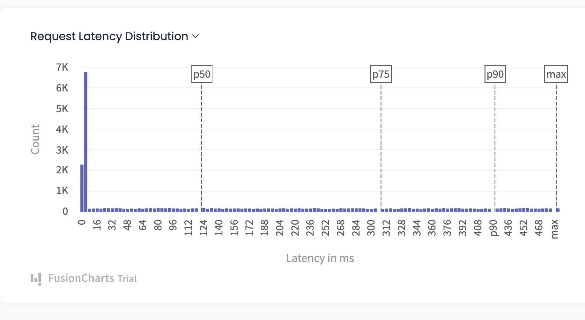

These days, it's difficult to find a modern application that isn't built on web APIs. APIs are crucial components of the automated workflow for any company, and as more customers depend on your APIs to power their applications, the demand for them to be dependable is growing. The stability of your business depends on continuously monitoring your APIs because any deterioration in their health, availability, and performance will affect your project.

## What you monitor is just as crucial as how you monitor when it comes to APIs.
Although data is useful, the actual value lies in actionable data. When relying on API integrations and online services, we’ve highlighted the most popular and important indicators to keep an eye on below. The information your company needs to decide which APIs to utilize, how to create robust apps, and where to concentrate your engineering efforts may be obtained via accurate monitoring and alerting.

## Getting Started with Terms Related to API Metrics check

**The Latency Check:** API latency is the amount of time it takes for a user to receive a response after submitting a query to your infrastructure. In latency a lower number is preferable. Connection issues between your server and the API server may be a result of latency. Delays between your server and the API server can be the reason. This could be due to network traffic or resource overload, in which case throttling the requests might be able to handle the high demand. The web service keeps track of the timestamps for the outgoing and incoming requests and compares them to past and present requests over a certain period to monitor latency. This can still be challenging because the server’s responses will still be impacted by response time. The best technique to get a precise latency estimate, if available, is to ping an endpoint or dial a health-check endpoint. When arranging servers geographically, this assessment may be helpful. Your company can decide which provider to choose by identifying the one with the lowest latency. If it is determined that latency is the real cause of your responses being delayed, you can also choose specific regional provider services, or you can choose another provider if the issue is with the speed at which your resources are responding. In real use, latency and response time are frequently integrated into one metric. Overall, the user experience improves with a faster reaction time.

 
**Response Time:** In addition to API latency, or the time it takes for information to flow from the server to the requesting party, response time also includes the amount of time a server needs to process the request. Due to the latency’s inclusion in the assessment of reaction time, the response rate will always be longer than the delay. The term “API latency rate” describes how long it takes for requested data to go from the API server to the party making the request. Response time accounts for both latency and the processing time required to process the request. Response time is the amount of time it takes for a service to react to a request, whereas latency accounts for network delays. Since the response time includes the latency to send and receive data, this can be more difficult to track using third-party APIs and web services. By comparing the response times of several resources on a specific API, you may estimate response time. This allows you to determine the true value and estimate the shared latency between your servers and the API’s servers. The performance of your application is directly impacted by the response time. Your users’ interactions will be slower as a result of API response delays. If your selected API is secure, you can prevent this.

**Availability:** An API’s availability can be characterized as either uptime or downtime. Both are based on the same data, but depending on the context, they can each portray a different tale. Perhaps the simplest statistic to monitor is availability. As an API provider will often advertise scheduled outages, downtime faults are easily identifiable and occasionally expected. Even the most dependable APIs, nevertheless, can have unplanned outages. Downtime can be displayed as a series of discrete incidents or as an average over a specific time frame. Even the tiniest downtime can significantly impact your application, even though downtime quotas and assurances like “99.999 percent uptime” can be helpful when evaluating an API provider.

## To Ensure Peak Performance, Use API Monitoring Tools
If you don’t have the proper tools, managing and monitoring them could be challenging. The performance of APIs may be negatively impacted by any of these. But most of the time, if you have a little foresight, you may simply avoid such problems. This is where API monitoring solutions like APIToolkit are useful. By locating and correcting the problems before they affect your users, they will assist you in catching errors and developing trustworthy APIs. Examine the advantages for yourself by using APIToolkit.

## Still, wondering why you should trust APIToolkit with your API Metrics?
APIToolkit is focused on security and compliance We focus on determining problems before they affect customers The integration process is simple, to use, and maintain without sacrificing security.

Anticipate our launch  this November, as we are finally stepping out of the Beta. If you’ll like to get onboarded into APItoolkit before then (and benefit from our early user advantages), please feel free to reach out.
I bring you greetings from Kigali (Rwanda), It was a great experience collaborating with founders and possible APIToolkit users. We get into more details when the outcome of our collaboration becomes evident
Do have a lovely weekend where ever you are, and stay happy.

Anthony Alaribe
Co-founder APItoolkit
