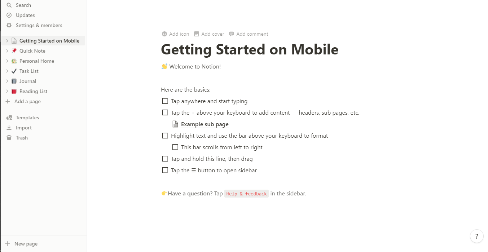
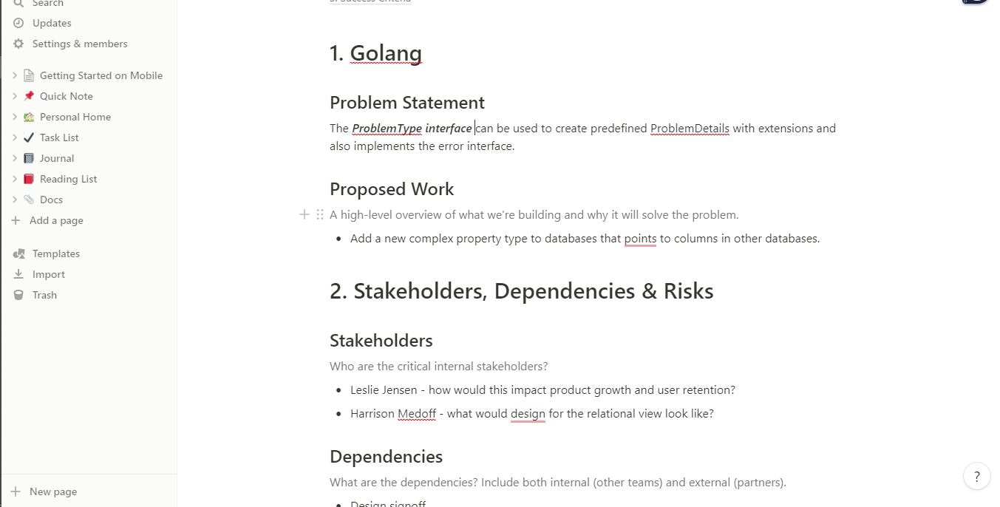
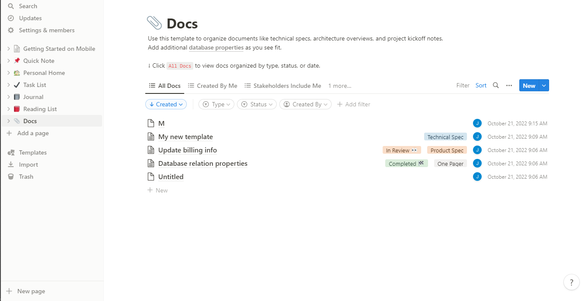
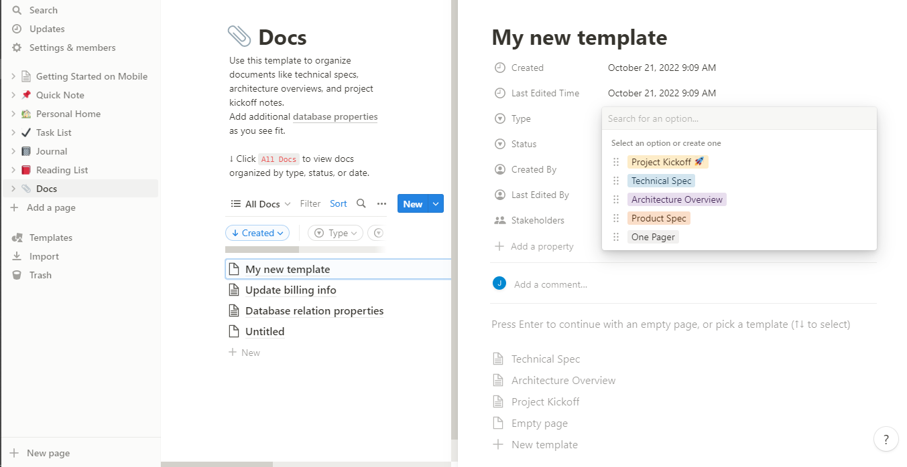

It wouldn’t be an oversight if I say Notion is that one app that has it all. I mean every developer or creative will agree to the fact that notion is a really great tool. It is an all-in-one workspace for any company that always gets the work done. I mean notion does everything, from being a storage app for documents to a product map, and then API Documentation. You get the idea, it is a flexible tool with millions of ways it can be utilized. However, one of my favorite applications for Notion is open API documentation. Giving appropriate documentation on how to use a product, in my opinion, is a big bonus because it makes everything easier and less stressful for everyone especially developers. 

## Quick guides on how to build API documentation using Notion are provided below.
The first step is to create a [Notion](https://www.notion.so/personal) account that’s if you don’t have one.

With notion, you have the choice of either creating a template from scratch or using an already-existing design that is appropriate for the type of information you want to publish.

### Here I am working with an existing template
You can select from this list of templates.

I choose doc because I will be working with documentation and there are many alternative templates available to me here.

And you're all set to move forward with your top-notch, informative documentation, boom.

### Here I chose to go with a new template because I want it to be a bit different from the usual
I am not the only one that sometimes wants something different, we all do and notion is also in the business of giving its users what they desire. To create a new template in Notion, you simply click on the doc option under templates, It taks you you to a screen that has New boldly written on the right side of the screen

The first process leads to a blog-like page that allows you to fill in info about your documentation 
[Choose new template](choosing-a-new-template.png)

And the type of doc format you choose to work with. this matters because it determines the type of layout your documentation will have.

And when you are done filling out the form, you can go ahead to start documenting every bit of that process to guide your users accurately.

## Automation is fast and more effective
An [API Documentation](../top-8-api-documentation-tools-for-developers) is an essential component of each API project. The documentation should accurately reflect each step of the process and should be easy to understand for new users; however, if it is written with no form of orderliness or in a hurry, it may end up being jumbled

Notion is totally perfect as an app for maintaining a workflow environment but has a bit lapses as regards documenting. The important thing to note is that not all developers have enough time on their plate to go about the notion process so they will prefer automatic documentation tools like APIToolkit to automate theri documentation and keep it up to date. [Click ](../updates-october-2022) to learn more about APIToolkit.

