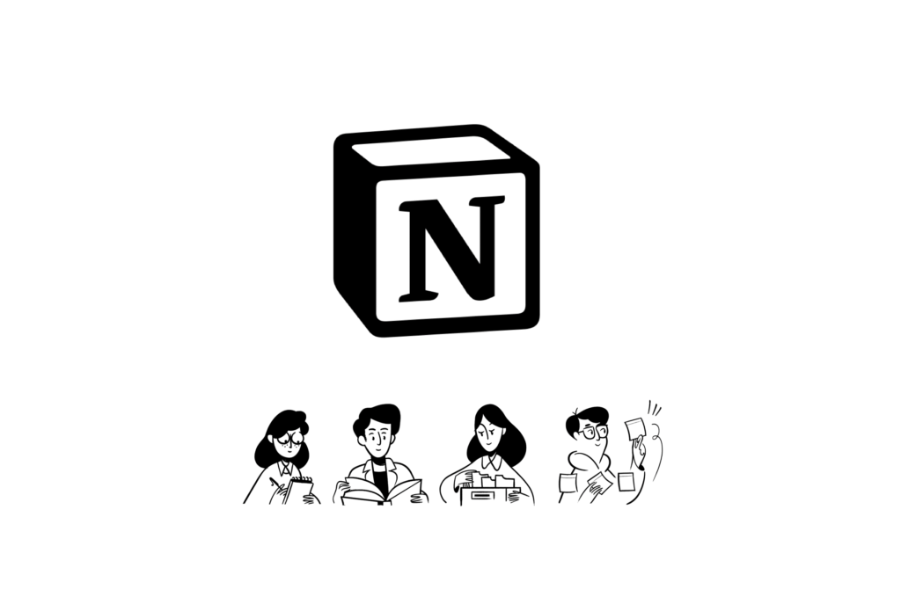
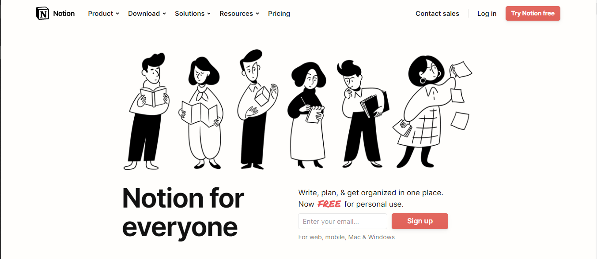
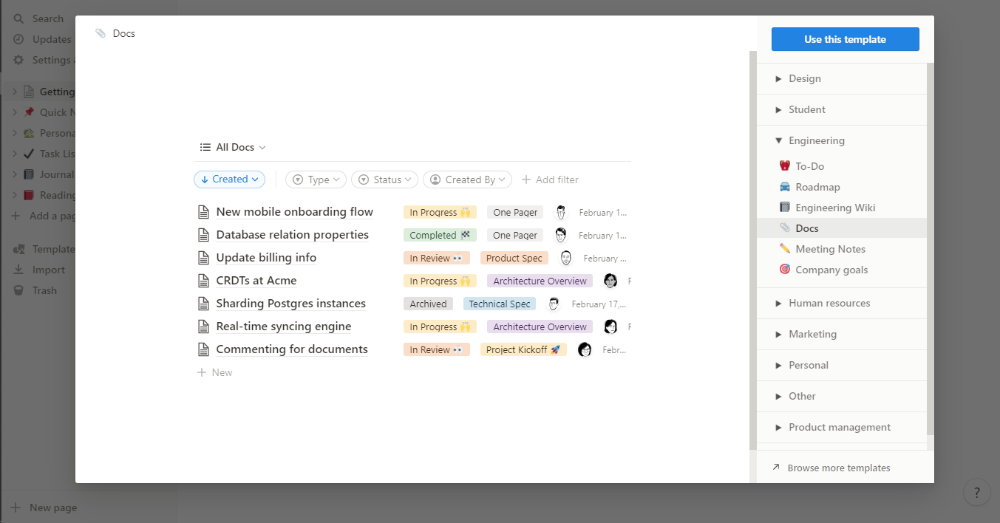
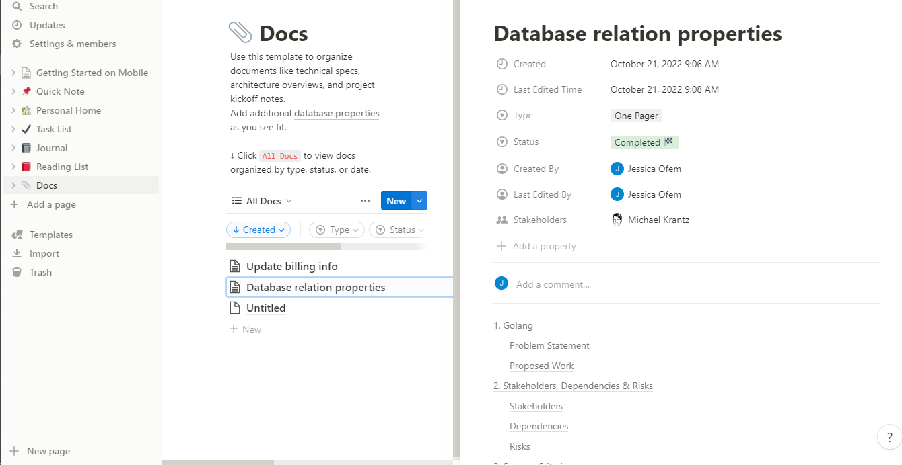

Documentation is a vital part of any product because it aids in making clear directives, specifics, staff conversations, and other information that can be unclear to not just workers but users too.  A permanent record of successes is provided by good documentation, which may be useful in future talks with clients or with the company's directors and legal counsel. The ability to rapidly and effectively provide support, such as figuring out what a particular piece of software is (or was) supposed to perform, is another benefit of thorough documentation. These justifications for the significance of documentation.

It wouldn’t be an oversight if I say [Notion](https://www.notion.so/) is that one app that has it all. I mean every developer or creative will agree to the fact that notion is a really great tool. It is an all-in-one workspace for any company that always gets the work done. Notion does everything, from being a storage app for documents to a product map, and then API Documentation. You get the idea, it is a flexible tool with millions of ways it can be utilized. However, one of my favorite applications for Notion is open API documentation. Giving appropriate documentation on how to use a product, in my opinion, is a big bonus because it makes everything easier and less stressful for everyone especially developers. 
 
## Benefit of Proper Documentation
A well-documented information is  essential especially  now that the society is driven by sophisticated technology. When we can't quickly access the information we require, and there is no support at all, or the information that is provided is insufficient, we become incredibly frustrated. Therefore, badly written documentation will cost more money for any company or product. Never consider your paperwork to be an expense, but rather a way to reduce costs! 

### Successful User Experience
When you have quality written content, the end-user experience will be more successful. Your customers will become dissatisfied if your product's user guide is inadequate or nonexistent, and your online assistance is ineffective. It wastes users' time, and your support is late to arrive or not available at all. Your software company's reputation suffers as a result.

### Increase Sales
The availability of user-friendly product information leads to increased sales. As a result, agreement on system functionality is obtained between IT workers and client business departments, completing the documentation for the system and its users.

### Usability
Free software product usability testing. Documenting a software program can help identify and correct functional and UX issues. All software system settings are essentially assessed for presentation and usability to provide comprehensive user documentation.

## Quick guide on how to build documentation using Notion are provided below.
The first step is to create a [Notion](https://www.notion.so/personal) account that’s if you don’t have one.

With notion, you have the choice of either creating a template from scratch or using an already-existing template that is suitable for the type of information you want to publish.

### Here I am working with an existing template
You can choose from the list of templates given.

I go with a doc because its a documentation and it hass different layouts like technical spec to choose from

Choosing a layout gives you a good documentation format to work with and with it you're all set to move forward with your top-notch, informative documentation.

### Here I chose to go with a new template because I want it to be a bit different from the usual one.
I am not the only one that sometimes wants something different, we all do and notion is also in the business of giving its users what they desire. 
To create a new template in Notion, you simply click on the doc option under templates, It takes you you to a screen that has New boldly written on the right side of the screen. Now click new.

The first process leads to a blog-like page that allows you to fill in info about your documentation 
[Choose new template](choosing-a-new-template.png)

And the type of doc layout you choose to work with. This matters because it determines the type of layout your documentation will have and should also be decided based on the type of ddocumentation you want to write.

And when you are done filling out the form, you can go ahead to start documenting every bit of that process to guide your users accurately.

## Automation is fast and more effective
An [API Documentation](../top-8-api-documentation-tools-for-developers) is an essential component of each API project. The documentation should accurately reflect each step of the process and should be easy to understand for new users; however, if it is written with no form of orderliness or in a hurry, it may end up being jumbled

Notion is totally perfect as an app for maintaining a workflow environment but has a bit lapses as regards documenting. The important thing to note is that not all developers have enough time on their plate to go about the notion process so they will prefer automatic documentation tools like APIToolkit to automate theri documentation and keep it up to date. [Click ](../updates-october-2022) to learn more about APIToolkit.

