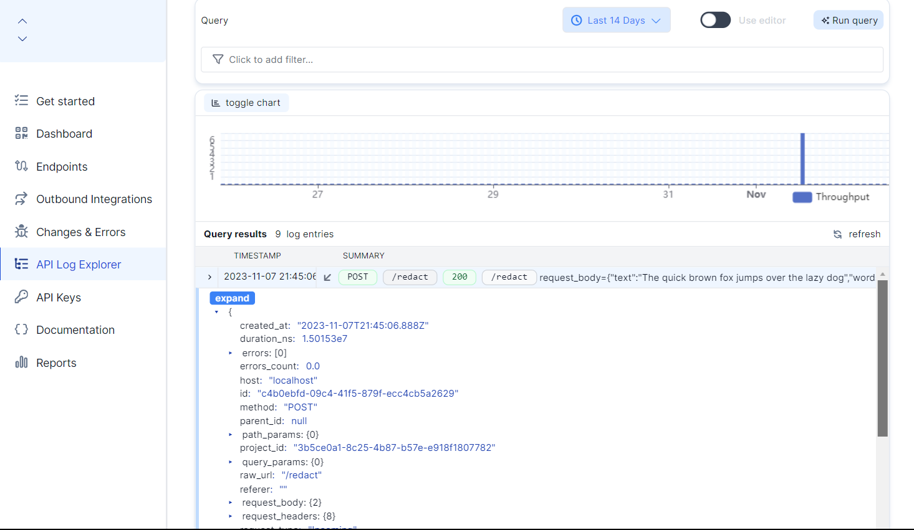

APIToolkit is a powerful tool that sits in front of your application, capturing and recording all incoming traffic to the API. With APIToolkit, developers can gain valuable insights into the API usage and diagnose potential issues effectively. However, it is essential to ensure the privacy and security of sensitive information transmitted through the API.

## Ensuring Data Privacy and Security

The value of the API Toolkit extends far beyond its capacity for intricate diagnostics; its critical function in safeguarding data confidentiality and security is paramount. Acknowledging the delicate essence of data managed through APIs, the API Toolkit is equipped with a dual-layered defense system for data protection:

1. **Inherent Redaction:** The API Toolkit is designed with an intrinsic feature that automatically conceals recognized sensitive fields, thereby fortifying them against potential compromise.

2. **Configurable Field Redaction:** Advancing its security capabilities, the toolkit also enables tailored field redaction. By utilizing JSONPath expressions, either through the API Toolkit dashboard or any associated SDK, users can define and omit specific sensitive fields. This function is vital for the meticulous exclusion of sensitive data such as passwords, personal identification numbers, and credit card information, ensuring these details are systematically removed from any logged traffic.

## Redacted Field Value: JSONPath

API Toolkit leverages JSONPath, a widely adopted query language, to specify the fields that need to be redacted. JSONPath allows you to navigate and query the JSON data structure effectively, enabling precise control over which fields should be redacted. [lean more about JSONPath](https://lzone.de/cheat-sheet/JSONPath). Redacting means that those fields would never leave your servers at all. So you feel safer that your sensitive data only stays on your servers.

To redact a specific field, you need to specify the JSONPath expression representing that field. For example, consider a JSON object representing a user's data:

```json
{
  "user": {
    "id": 123456789,
    "name": "John Doe",
    "password": "secretpassword123",
    "creditCard": {
      "number": "1234567890123456",
      "expiry": "12/25"
    }
  }
}
```

To redact the password field, you would use the following JSONPath expression: `$.user.password`. Similarly, to redact the number field within the creditCard object, you would use `$.user.creditCard.number`. By specifying these JSONPath expressions, API Toolkit will exclude these fields from the captured traffic, ensuring sensitive information remains protected.

## SDK-Specific Redaction Guides

API Toolkit supports a variety of development environments. For detailed instructions on implementing field redaction within your chosen framework, please refer to the SDK-specific guides below:

- **.NET SDK**: [Redaction Guide for .NET](../Quickstarts/DotNet/DotNetCore.md)
- **Echo SDK**: [Redaction Guide for Echo](../Quickstarts/Golang/Echo.md)
- **Gin SDK**: [Redaction Guide for Gin](../Quickstarts/Golang/Gin.md)
- **Gorilla SDK**: [Redaction Guide for Gorilla](../Quickstarts/Golang/Gorillamux.md)
- **Express.js SDK**: [Redaction Guide for Express.js](../Quickstarts/NodeJS/ExpressJS.md)
- **Fastify SDK**: [Redaction Guide for Fastify](../Quickstarts/NodeJS/Fastify.md)
- **NestJS SDK**: [Redaction Guide for NestJS](../Quickstarts/NodeJS/NestJs.md)
- **Laravel SDK**: [Redaction Guide for Laravel](../Quickstarts/PHP/Laravel.md)
- **Symfony SDK**: [Redaction Guide for Symfony](../Quickstarts/PHP/Symfony.md)
- **Django SDK**: [Redaction Guide for Django](../Quickstarts/Python/Django.md)
- **FastAPI SDK**: [Redaction Guide for FastAPI](../Quickstarts/Python/FastAPI.md)
- **Flask SDK**: [Redaction Guide for Flask](../Quickstarts/Python/Flask.md)

Here is a screenshot of a redacted field on our Log Explorer


## Conclusion

Data security and privacy are crucial considerations when working with APIs. APIToolkit's sophisticated traffic capturing abilities, combined with its powerful field redaction features, offer a double-edged sword against data vulnerability. By using JSONPath for strategic data exclusion, API Toolkit not only simplifies compliance but also cements your commitment to preserving user confidentiality.